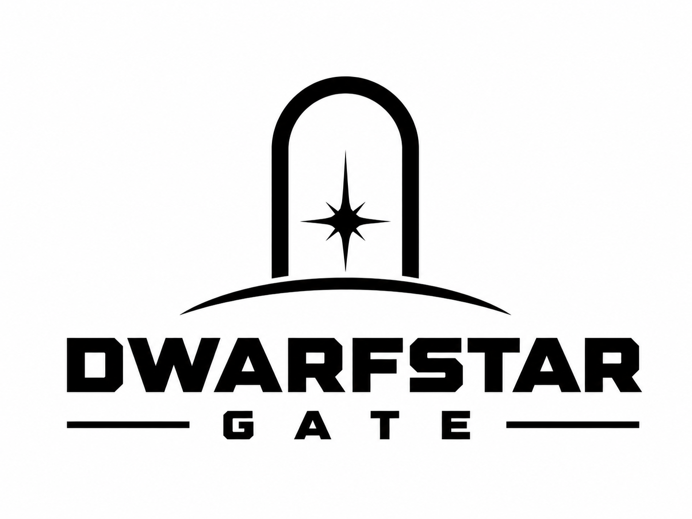
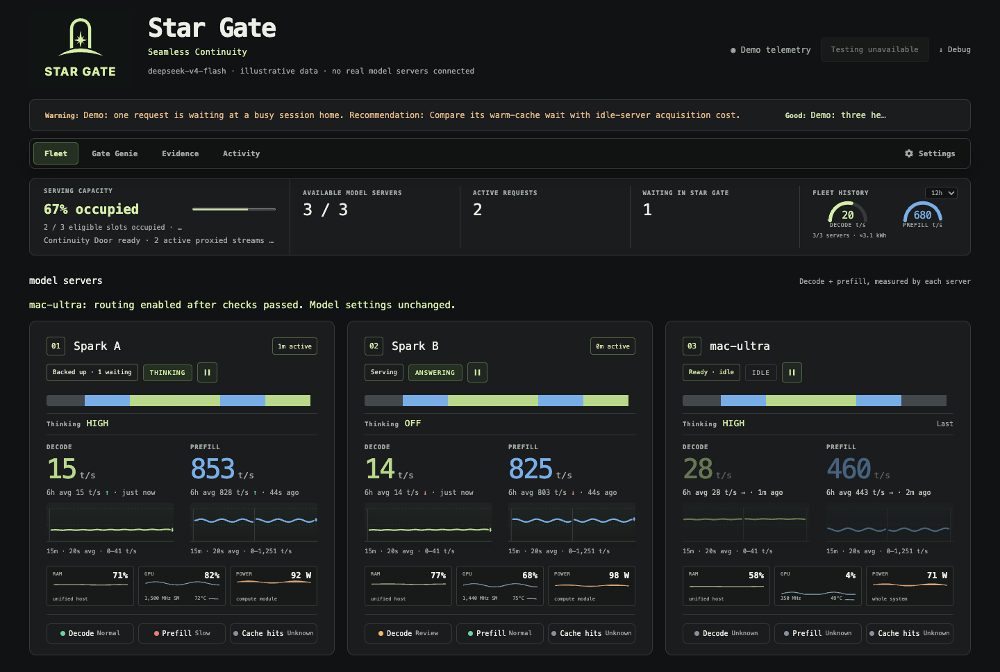
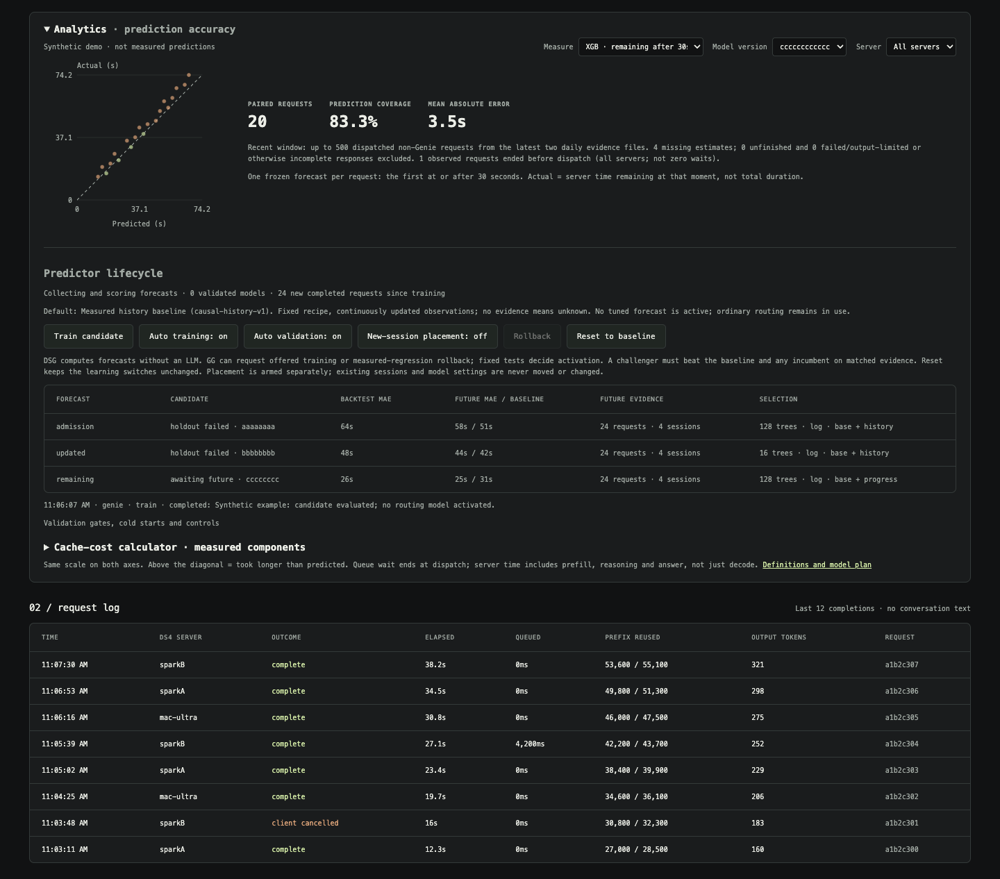
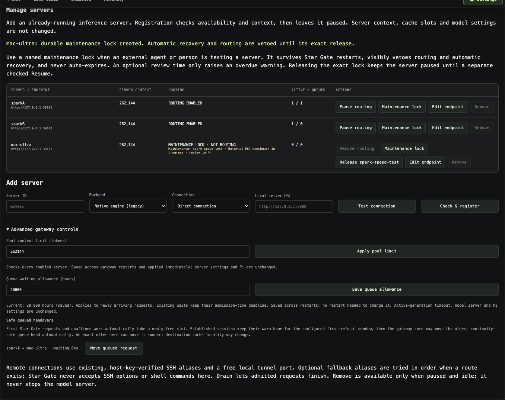

# Dwarf Star Gate



A local gateway for **N DS4 servers—DGX Sparks, Macs, or a mix**, with durable session affinity
and a lightweight control-room dashboard for [DS4](https://github.com/antirez/ds4).
Register workers through the local UI or CLI; fleet size is not hard-coded.

**Implemented, opt-in:** private routing evidence, fleet activity, and **Gate
Genie**, a local fleet assistant with optional [bounded DS4 service recovery](docs/worker-recovery.md). See the [prioritized feature roadmap](docs/roadmap.md)
and [experimental collector/Genie setup](docs/observer.md). Cache-health auditing
and cache migration remain roadmap items. The optional [predictor lifecycle](docs/predictor-lifecycle.md)
adds live shadow forecasts, causal next-turn history, embedding-aware updates,
remaining-time models, fixed cross-validation and future-traffic promotion gates.
Prediction-assisted **new-session** placement is separately opt-in and requires
unseen-session evidence; existing sessions never move. A fitted model alone does
not qualify. The [v1 offline experiment](predictor/README.md) remains reproducible.
Workers with recognized engine faults or repeated inference failures are
[quarantined persistently](docs/generation-health.md); recovery requires a real
generation check. Opt-in recovery can restart an enrolled systemd-user DS4 service
after current-instance fatal evidence, then verify generation and cold-to-warm
reuse. Unsupported installs remain manual. No Pi or Hermes dependency.

The dashboard's **Genie health wire** shows model-written observations and concise
recommendations from the same fleet review as the detailed assessment. Evidence
time is explicit; stale or health-invalidated advice is withheld. This is advisory
LLM output, not verified diagnosis or executed action. Hover/focus or pause to read;
reduced motion shows static text. Expanded assessments stay open across refreshes.

Optional [queued-work shadow collection](docs/routing-shadow.md) records idle and
session-recency clocks and compares a historical baseline without moving work.
Its estimates are explicitly unvalidated; no live XGB routing is implied.
Separately opt in to [local embedding/progress collection](docs/embeddings.md)
for future workload models. Analytics also includes a read-only
[cache-cost calculator](docs/cache-cost.md) using measured disk-load/prefill
components. Unknown cache costs and unverified cache existence stay explicit.

## The engine is Antirez's. Start there.

**Dwarf Star Gate exists because of [DwarfStar — the original `antirez/ds4`
project](https://github.com/antirez/ds4), created by
[Salvatore “antirez” Sanfilippo](https://github.com/antirez) and its contributors.**
That is the inference engine doing the substantial work: running the models,
processing prompts, generating tokens, serving requests and managing KV state.
The engine, not this gateway, deserves the credit for those capabilities.

This repository adds a small routing and observation layer around it. We did not
create DS4, its inference kernels, its quantization work, or its cache engine.
Thank you, Salvatore, for making such an ambitious local-inference project
available, understandable and adaptable. **If you find this gateway useful,
please visit and star [the original project](https://github.com/antirez/ds4).**

- **Start upstream:** [DwarfStar repository](https://github.com/antirez/ds4) ·
  [setup and engine documentation](https://github.com/antirez/ds4/blob/main/README.md).
- **Read the work:** [HTTP server](https://github.com/antirez/ds4/blob/main/ds4_server.c) ·
  [KV store](https://github.com/antirez/ds4/blob/main/ds4_kvstore.c) ·
  [CUDA backend](https://github.com/antirez/ds4/blob/main/ds4_cuda.cu).
- **Contribute upstream thoughtfully:**
  [contribution guide](https://github.com/antirez/ds4/blob/main/CONTRIBUTING.md) ·
  [release QA](https://github.com/antirez/ds4/blob/main/QA_BEFORE_RELEASES.md) ·
  [MIT license and copyright notices](https://github.com/antirez/ds4/blob/main/LICENSE).
- **More:** [Antirez's writing](https://antirez.com/) · [full credits](CREDITS.md).

Dwarf Star Gate is an independent companion project, not an official Antirez
release and not a claim of his endorsement. The similar name is an acknowledgement
of the engine it was built around, not a claim to its authorship.

The gateway/dashboard use Node.js built-ins only; the optional systemd recovery
helper uses Python's standard library. No package installation, database, Kubernetes, frontend
build system, CDN, analytics service or cloud telemetry.

The optional predictor trainer and CPU embedding encoder use separate, locked
Python environments. Neither is required for ordinary gateway/dashboard operation;
the encoder runs only when explicitly configured, without cloud inference.

## Dashboard

Terminal-inspired presentation, per-worker measurements, and a replaceable logo.
These earlier illustrative captures use **synthetic demo data**, not live sessions
or benchmarks. They are not a complete feature tour: the current UI also includes
the collection/activity panels and optional Gate Genie described below.



<details>
<summary>Cache and request-log view</summary>



</details>

Run `npm run ui:demo` for the isolated screenshot preview on loopback port 30011.
It does not connect to workers, read local logs or load production configuration.
The regular dashboard is on port 30010. Artwork lives at
`ds4-gateway/ui/logo.png`; it can be replaced without touching gateway behavior.

The dashboard also ships a logo-derived gate/star icon: SVG and 16/32px ICO
favicons, a 32px PNG, a 180px Apple touch icon, and a monochrome Safari pinned-tab
mask following [Apple's pinned-tab guidance](https://developer.apple.com/library/archive/documentation/AppleApplications/Reference/SafariWebContent/pinnedTabs/pinnedTabs.html).
The wordmark is omitted at icon sizes for legibility. Safari may retain an older
site icon; reload, then unpin/re-pin the tab if necessary. The vector source is
`ds4-gateway/ui/dsg-pinned-v1.svg`; `scripts/build-icons.mjs` regenerates the other
assets with development-only Sharp. Generated assets are committed, so using DSG
does not require Sharp or an icon build step. The main logo is unchanged.

## The gateway

A **DS4 server** is one registered model-server endpoint. Code, configuration and
CLI commands also call it a **worker**; these mean the same thing, not necessarily
a physical machine. Each server may have its own native context and cache settings.

- Durable session affinity: later turns return to the same worker to improve the
  chance of KV reuse. Busy conversations queue at home instead of bouncing.
- Load-aware placement of **new** conversations; at most one active upstream request
  through DSG per registered DS4 server. Extra requests wait in bounded FIFO queues.
- Transparent request/stream passthrough: no reasoning, output-limit, sampling,
  vision or tool-call rewriting.
- No automatic replay after an ambiguous upstream failure.
- SSH tunnel recovery, model/context health checks and durable per-worker drain.
- Private Unix-socket operator controls, not a public worker-admin endpoint.

It does **not** move caches, guarantee hits, manage model containers, or know GPU
memory pressure. DS4 owns cache validity and GPU concurrency. Draining here does
not prove a worker has no direct clients; verify those before stopping it.

**Concurrency and dashboard counts:** one active request includes prefill, thinking
and decode, for both streaming and non-streaming responses. Three healthy, enabled
servers can handle up to three active gateway requests, one each; session affinity
may still queue requests at a busy home while another server is idle. Available
means healthy and enabled, not idle. Direct clients bypass these gateway counts and
limits. Warm/hot KV slots retain sessions and do not add simultaneous generation
slots. DSG does not alter the native server's own concurrency configuration.

Use one registration per server instance; duplicate aliases to the same instance
can defeat the per-server limit. Separate instances on the same physical machine
are scheduled independently—DSG does not coordinate their shared RAM/GPU capacity.

## Quick start

**Using DGX Sparks? The [recommended Spark configuration](docs/recommended-spark-profile.md)
specifies this experimental baseline:** Vision-Exp IQ2/Q2 with
vision enabled, 262,144-token context/output allowance, two hot sessions, one active
request per Spark, a 349,525 MiB disk-KV budget and the full acceleration cache.
The guide pins the engine and weights and describes acceptance checks and limits.
It remains our recommendation until explicitly superseded; it is not an upstream
endorsement or a profile automatically applied to Macs or registered servers.
**Known reliability limits:** CUDA faults and OOM conditions remain unresolved
risks. The exact settings are preserved; they are not a long-context stability
guarantee. Read the profile's caveats before adoption.

Requires Node **22.22.2+**, running DS4 servers, and SSH for remote workers. Gateway runs on macOS or
Linux. The optional click-to-open service scripts use macOS LaunchAgents.
Install and understand the worker engine using
[Antirez's upstream instructions](https://github.com/antirez/ds4/blob/main/README.md)
first; this repository does not replace them or distribute the engine/model weights.

```sh
git clone https://github.com/JordiPosthumus/dwarf-star-gate.git ~/DSG
cd ~/DSG
npm run setup -- --controls
npm run hooks:install
npm run doctor
npm start
# In another terminal, from the same checkout:
npm run ui
```

No `npm install` is needed for the core. Setup creates an ignored, mode-0600
`config.local.json` with a random API key and an empty worker list. It never
overwrites an existing configuration. Omit `--controls` for a read-only dashboard.
Open **http://127.0.0.1:30010**, expand **Manage DS4 servers**, add existing DS4
endpoints and enable them after the compatibility check. Remote servers need a
working SSH alias; local servers use their loopback URL. DSG does not install DS4.
New configurations use **127.0.0.1:30001/v1** for inference; existing port settings
are not changed. Read the client key from your private config, never publish it.

On macOS, use login services instead of the foreground processes (stop those
first):

```sh
npm run service -- install
npm run service -- start
npm run service -- status
# Stops/restarts refuse busy or unknown gateway state unless explicitly approved:
npm run service -- restart
# npm run service -- restart --interrupt
```

These commands manage only DSG's gateway and dashboard, never model servers.
Worker controls register/enable/drain/remove routing endpoints. Separately enrolled
[service recovery](docs/worker-recovery.md) adds a guarded DS4 restart capability.
The convenience UI launch scripts remain supported on macOS.

**One checkout, no deployment copy:** source, ignored `config.local.json` and
ignored `runtime/` live together. All launchers/operator commands use that config
by default, even from another working directory. `DWARF_GATE_CONFIG` selects a
different file; explicit CLI config arguments take precedence where supported.
Relative local paths resolve beside the config file. Remote SSH paths do not.
See [installation, upgrades and private files](docs/installation.md) for details.

## Monitoring and debugging

Per worker, the dashboard displays:

- Actual decode chunk t/s and request-average t/s, including reasoning tokens.
- Actual prefill chunk/average t/s for **new** tokens, excluding the cached prefix.
- Timestamped last readings, independent 15-minute sparklines, gateway health,
  active duration, waiting requests and assigned conversation counts.
- Observed prefix reuse, genuinely cold starts, resident misses and disk restores.
- Recent request outcomes, queue time, elapsed time and returned usage counters.

Timing comes from a read-only SSH journal follower on Linux. The default remote user unit
is `ds4-vision-q2.service`; set `telemetry_service` per worker if yours differs.
The observer parses known DS4 log formats; missing information is unknown, never
an invented hit or speed. No inference request is made for metrics. Newly registered
workers default to `telemetry_service: null`. An optional `--journal-unit`
on CLI registration enables a Linux worker's journal follower.

For a Mac DS4 engine on the **same host as the dashboard**, add an explicit path
to its existing engine log in the ignored private gateway config, keyed by its
registered worker ID:

```json
"telemetry_files": { "studio": "/var/log/ds4/engine.log" }
```

Use your actual log path; DSG does not create it, change model logging or restart
the engine. Reload **only the dashboard** after editing this mapping. It takes
precedence over journal telemetry for that worker and shows **Model log connected**.
The file must be readable, regular and not a symlink. Missing/unreadable logs show
disconnected, with old samples dated rather than replaced by invented zero rates.
The mapping and raw lines are never exported by status/diagnostics or stored in
measurement logs, and the UI cannot select arbitrary files. This does not yet
follow logs on a remote Mac over SSH; configure a Linux journal or a local file
as appropriate. Do not point it at a log containing interleaved model instances.

Local logs use DS4's `MMDD HH:MM:SS ds4-server:` format and the dashboard host's
timezone (the nearest year is inferred at New Year). Initial replay is limited to
the last 256 KiB and 15 minutes; reads are at most 256 KiB per two-second poll,
partial lines are capped at 64 KiB, and older/oversized/unrecognized lines are
skipped. Rename rotation and copy-truncation are detected; a missing file is retried.
Unread data removed by rotation can be lost: this is bounded observation, not a
lossless logging service. Stable sample IDs permit replay deduplication. A prompt
start outside the observed tail remains unknown until the next one, even if decode
measurements are already visible. No model request is generated for telemetry.

An idle Spark retains its **last** measured speed with its age. It is not current
throughput. A resident-cache miss can still produce a disk hit. Positive cached
tokens alone do not prove RAM residency. Counts cover observed prompt starts,
including up to 15 minutes / 2,000 initial journal records, not lifetime hit rates.
Non-streaming responses without observed usage show unknown token counters.

Each worker's **Requested thinking** indicator reports the active client's
controls, separately from the engine's current THINKING/DECODE phase. Idle workers
show the last finished request and its age. Hover for the exact source fields:
`reasoning_effort`, `reasoning.effort`, `output_config.effort`, boolean `thinking`
or `thinking.type`, optional `thinking.budget_tokens`, and `enable_thinking`.
These are observations, not a promise that a particular engine honors each field
or distinguishes every requested level. Multiple controls are shown together;
the gateway does not choose their precedence or rewrite them.

Omitted controls show **Not specified**; unknown metadata never becomes an assumed
level. The observer captures up to **8 MiB per dispatched upload in transient RAM**,
parses it once at upload completion, then releases body references and retains only
allowlisted scalar metadata. JSON parsing has a small CPU/temporary-memory cost.
Over-budget, encoded, malformed or incomplete uploads show **Unknown**; their
original bytes continue through the same streaming pipe. This budget is **not** a
request-size, context or output cap. Queued bodies are not inspected before dispatch.
Requested metadata is included in completion events and sanitized diagnostics,
but not persisted in the affinity store. Last-request indicators reset on gateway
restart; old events without metadata remain unavailable.

```sh
./gateway-status.sh
./gateway-logs.sh
./gateway-debug.sh
```

The **Debug snapshot** button or command exports allowlisted metadata only:
status, bounded recent timings and the last 100 request events. It excludes
prompts, answers, images, tool arguments, credentials, backend addresses and raw
journal lines. Hashed conversation identifiers, request IDs and timings remain;
review even sanitized diagnostics before sharing publicly.

Parsed measurements are appended to private daily JSONL files under `dashboard/`
beside the configured state file (the default is `runtime/dashboard/`).
`sample_id` deduplicates history replay across dashboard restarts. Logs are **not**
deleted or automatically rotated: choose retention for your installation.
Raw gateway logs can contain SSH error messages and host details; do not publish
them without review. Monitoring logs are separate from the inference path.

The local **Analytics** panel compares saved shadow forecasts with actual queue
waits and server durations, with sample counts, missing-prediction coverage and
per-server filtering. Select historical baselines or separately versioned XGB
forecasts at admission, after upload/embeddings, or while active. See
[analytics definitions](docs/analytics.md) and [validation/controls](docs/predictor-lifecycle.md).
The same panel shows optional embedding collection status and the cache-cost
calculator. Those retain their independent meanings; they do not replace the
historical charts. GG can request bounded training or measured-regression rollback;
the fixed validator, not an LLM, decides whether a candidate qualifies.

## Client affinity

Send a stable `x-session-affinity` header for each conversation. Other accepted
headers are `x-ds4-conversation-id`, `x-session-id`, and `session_id`.
Use distinct, unpredictable identifiers for independent conversations.
Without a header, requests work but do not receive durable session affinity.

The gateway returns `x-ds4-node`, `x-ds4-affinity`, and `x-request-id`. Bodies and
SSE bytes remain unchanged. Reassignment only occurs when the old home is
unavailable/drained **and** has no unresolved gateway work. The assignment is
saved before dispatch. Never change a worker ID to mean a different machine
without considering its persisted assignments and caches.

Worker membership can change live without restarting the gateway. Stable IDs retain
their assignments. Removing a paused, idle worker leaves its old session homes in
the store; the next request can reassign normally. It does not delete server caches.

The UI snapshots and validates its full HTML/CSS/JS/image bundle at startup.
Stage all UI files and test first, then reload only the dashboard to promote a
complete release. Editing files does not partially update a running dashboard.

## Operator controls

Set `"ui_worker_management": true` in your private config and reload the dashboard
to expose **Manage DS4 servers**. Keep this dashboard on loopback, not behind a public
proxy. The controls use the private Unix socket, exact same-origin checks and a
per-dashboard CSRF token. They do not change inference API authentication.

1. Enter a stable server ID and choose **Local server** or **Remote server via SSH**.
2. For a local server, enter its URL. For SSH, supply an existing SSH host/alias,
   the remote server port and an unused local tunnel URL.
3. **Check & register** verifies the configured model and sufficient context. A
   successful registration is persisted **paused**, with no generation probe.
4. **Enable** admits requests. **Drain** stops new admission while already admitted
   work finishes. **Remove** is available only when paused and idle.

**Client routing is not worker membership.** To make a client use a Mac or Spark
only through DSG, change that client's provider endpoint to DSG and remove its
direct-provider entry. Keep the model server registered and enabled in DSG.
Draining/removing that worker instead takes its capacity away from **all** gateway
clients. Ask agents to distinguish these two operations explicitly.

Unexpected **Paused** or missing workers warrant checking `workers_drain_changed`
and `worker_removed` in the private gateway log. Failed health probes do not
remove workers; generation quarantine is a separate state. Current control events
record the action and target, but not authenticated caller identity: they cannot
by themselves prove which local person or agent acted. Genie cannot issue ordinary
pause/remove controls; it can request only independently guarded recovery when
authorized. Restarting DSG preserves manual pauses and removals.

<details>
<summary>Worker-management UI (synthetic demo)</summary>



</details>

Registration leaves native context, output limits, hot/disk slots, quantization,
thinking and server concurrency unchanged. Every worker must support at least the
configured pool `context_length`. A larger-context Mac keeps that native capacity;
the gateway advertises only the common pool guarantee in `/v1/models`. It does not
truncate prompts or outputs or automatically send oversized requests to that Mac.
For its larger context, use that server directly or a separately configured pool.
No per-request token counting or capability-tier routing is implemented.

DSG automatically refreshes each worker's reported context during health probes,
but **does not automatically raise or lower the pool guarantee**. Change it under
**Manage DS4 servers → Pool context limit**: DSG checks every enabled server,
backs up its metadata, saves the explicit setting and applies it immediately.
No model or gateway restart is required to apply a limit with this control.
The saved setting survives restart and overrides the startup `context_length`
default. Pi/client settings are separate. See
[Context limits and rolling upgrades](docs/context-limits.md).

Remote connections use gateway-owned SSH tunnels; existing SSH authentication and
host trust must already work. Registration does not install DS4 or provision keys.
Use each physical server once: different SSH aliases can hide a duplicate endpoint,
which model-name/context checks cannot detect.

The same controls are available from the CLI:

```sh
./workers.sh list
./workers.sh add studio --url http://127.0.0.1:8000
./workers.sh add laptop --url http://127.0.0.1:38103 --ssh worker-c --remote-port 8000
./workers.sh resume studio
./workers.sh drain studio
./workers.sh remove studio
```

`--config FILE` or `DWARF_GATE_CONFIG` selects your private config. The original
drain/resume CLI also remains supported:

```sh
node ds4-gateway/control.mjs status
node ds4-gateway/control.mjs drain-worker spark1
node ds4-gateway/control.mjs resume-worker spark1
```

Drain stops new admission to the named worker; existing queued/active requests
finish. State persists across gateway restarts. Six workers can drain four and
continue with two. The controller cannot stop model servers or creative jobs.
SIGUSR1/SIGUSR2 globally pause/resume admission; SIGTERM requests graceful gateway
shutdown. Service-manager deadlines can still interrupt long streams. Do not kill
or restart a live gateway casually; there is no blind restart script.

**Persistence and rollback:** `config.nodes` seeds the initial fleet. After the
first add/remove, `workers` in the existing affinity state file becomes the
authoritative roster, including an empty roster; editing seed nodes no longer
changes it. Back up both config and state before upgrades. Before rolling back to
an older gateway without registry support, copy the current roster into that older
version's compatible config during a planned shutdown. Otherwise removed seed
workers could return. Never restore an old affinity snapshot over newer sessions
without explicitly accepting that loss of routing history.

## Tests

```sh
npm run check
npm test
npm run privacy-check
npm run privacy:test
```

The Node unit/integration suite exercises local HTTP fixtures—not GPUs. Coverage includes
byte preservation, affinity persistence, FIFO admission, cancellation, no retries,
two-to-six-worker expansion, draining four of six, private operator control,
slow consumers, cache classification, journal deduplication, diagnostic redaction,
six-worker monitoring, complete UI asset bundles, hot registration/removal,
larger-context workers, empty-roster persistence, bounded health probes and the
opt-in same-origin/CSRF management boundary, local-log timing/cache parsing,
partial/oversized lines, rotation, truncation, missing-file recovery and redaction.
It also covers protocol-specific SSE completion, persistent generation quarantine,
verified reinstatement after remove/re-add, fresh control sockets after restart,
collector privacy, and bounded Genie/recovery boundaries. `npm run recovery:test`
also tests the optional Python adapter. Optional predictor tests
run with `npm run predictor:test` in the locked Python environment. See the
[dated maintenance review](docs/maintenance-review-2026-09-02.md) for findings and scope.
Default dashboards remain read-only.
Pool-size tests cover 1, 2, 3, 6, 12 and 20 fixture workers. These are validation
points, not configured limits or a claim of unlimited-scale load testing.
GitHub Actions runs checks and tests on Linux and macOS.

Validate streaming, reasoning, vision, tools, representative long-context work and
real disk restoration on each deployment. Local fixture tests do not certify a
100-hour stream soak, every client integration or every hardware/reboot combination.

## Security and privacy

The example binds loopback and contains only placeholders. **No private harness
configuration, production configuration, private network addresses, conversation
logs, model files, KV data or credentials are distributed.** Local configuration
and runtime output are ignored. A privacy check catches accidentally staged files
and common private data patterns; it is a guardrail, not a completeness guarantee.
Use `npm run hooks:install` to enable the repository-local pre-commit check.
The [publication policy](docs/publication-policy.md) separates reusable public
guidance from private deployment histories; exact staged blobs are checked and
the installer preserves existing custom hooks. New clones must opt in.

Treat this as a trusted-operator tool, not a multi-tenant security boundary. Keep
the inference listener behind an access boundary if exposing it beyond loopback.
The UI is loopback-only, validates Host/Origin, has no CORS grants, and uses a
restrictive content policy. The observer account needs DS4 journal read access.
Adding the UI does not change any model launch setting.

There is no open-source license grant yet; public visibility alone is not a license.
