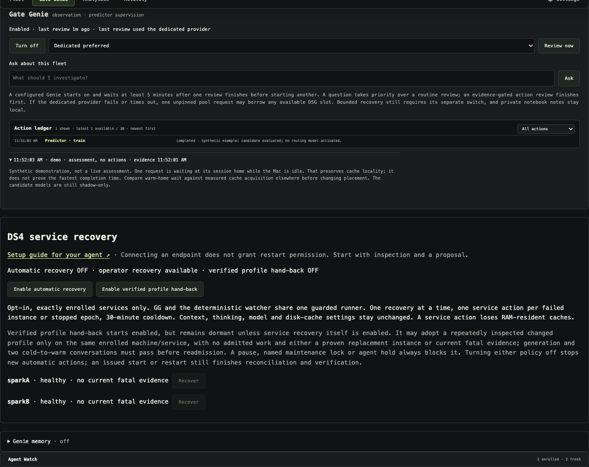
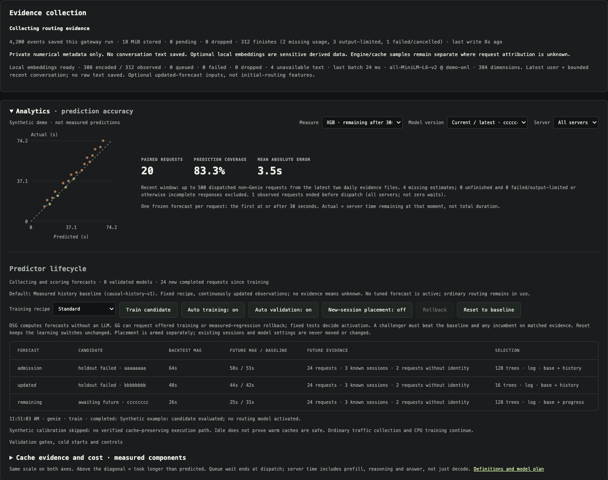
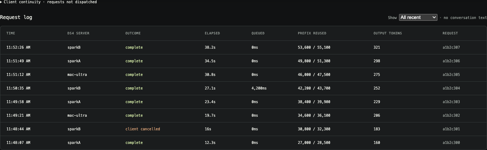

# Dwarf Star Gate

**Seamless Continuity**

Keep your agents working across a local DS4 fleet.


[MIT licensed](LICENSE) · Created by [Jordi Posthumus](https://github.com/JordiPosthumus).

[DS4](https://github.com/antirez/ds4) by [antirez](https://github.com/antirez) is an
excellent local inference engine. Running it efficiently across a home fleet
takes coordination: connecting your applications, preserving useful caches,
keeping track of queues, and dealing with server failures.

**Dwarf Star Gate is a local gateway for multiple devices running DS4—DGX Sparks,
Macs, or a mix.** It gives your applications one endpoint and you one dashboard,
helping you manage a home inference fleet with less manual effort and make better
use of your hardware. See which devices are busy or idle, where requests are
waiting, and how much time is spent processing prompts and generating responses.

> Our guiding light: a low-effort DS4 fleet that keeps agents working.
> Intelligence should make that dependable foundation better—not become another
> dependency that can stall it.

Reliable scheduling and client continuity come first. Genie supervises and
explains; predictive models earn authority through measured improvements, with
deterministic fallbacks. See the [delivery principles](docs/roadmap.md#delivery-principles).

**Gate Genie is DSG's local fleet assistant, enabled by default once configured.**
Point him at a dedicated
OpenAI-compatible DS4 server—an excellent role for older or slower hardware that
can still run a compatible model—or enable DSG pool fallback. If that dedicated
endpoint fails, he can borrow one available inference slot from the fleet and
keep watching the show. He reviews fleet evidence, explains problems in the
dashboard, remembers evidence-linked operational notes, and can request only the
bounded recovery actions you explicitly enable. Pool fallback consumes ordinary
inference capacity and never grants unrestricted machine access. See
[Genie setup and boundaries](docs/observer.md), [memory](docs/genie-memory.md),
and [service recovery](docs/worker-recovery.md).

**DSG also gives your local agents an easy control surface for managing the
gateway.** Its [scoped API and CLI](docs/agent-api.md) let authorized agents
inspect the fleet, temporarily take a server out of routing, and return it when
their work is done—without overriding your pauses or another agent's reservation.
An optional [Agent Watch](docs/agent-watch.md) heartbeat also lets DSG and Genie
tell local tool work, waiting inside DSG, and “the client says it is waiting but
no request reached this gateway” apart—without sending task or conversation text.

**Follow the project:** [recent work in plain English](WORKLOG.md) ·
[detailed changelog](CHANGELOG.md) · [next priorities](docs/roadmap.md).

Conversations stay with their assigned server to encourage cache reuse; new
conversations are placed according to load. Add, pause, resume or remove servers
through the local UI or CLI. DS4 handles inference and its caches; DSG handles
coordination and visibility across the fleet.

**The Continuity Door keeps the client endpoint stable during planned DSG core
maintenance.** It holds new request streams unread while existing responses drain,
replaces only the gateway core, verifies worker startup, then forwards each held
request exactly once. It never spools prompts or replays dispatched work. This
protects coordinated DSG restarts; it is not transparent recovery from an
arbitrary mid-generation engine crash. See the [exact contract](docs/continuity-door.md).

Each server card shows whether it is routing, paused, protected by a named
maintenance lock, reserved by an agent, or quarantined—and why. **Pause / Resume routing** is directly on the card; a
quarantined server offers **Verify & readmit**, which checks actual generation
before returning it to the pool. No hidden exclusion toggle or blind fault reset.

**DS4-specific, without modifying DS4:** use the engine's existing API and logs,
adapt to verified capabilities, and keep unknowns explicit. No custom DS4 patch
or rebuild is required. See the [integration boundary](docs/ds4-integration.md).

## What DSG adds

**Agent-friendly fleet management:** give a local coding agent a task such as
“drain this server for my DS4 test, then return it to the gateway when finished.”
With an explicit grant for that server, the agent can:

- Read live gateway status: health, active requests, queues and reservations.
- Drain the server while already admitted requests finish.
- Release its own reservation afterward; routing resumes only when no other
  hold or operator pause remains and readiness checks pass. If a legitimate
  patch changed a quarantined service profile, that explicit final release may
  instead hand control to the fixed verified-recovery executor; quarantine stays
  in force until full generation/cache checks pass.
- Check durable action receipts, so a lost reply does not mean blindly repeating
  an operation. The dashboard shows who holds each server.

This works with any local agent that can run the supplied client; no Pi or Hermes
dependency. It uses the same private control executor as DSG's operator and
Genie controls, with separately scoped permissions. It cannot submit commands,
profiles or bypass a hold; only the fixed recovery controller can act after an
explicit maintenance hand-back. See the [agent setup and permission guide](docs/agent-api.md)
for copyable instructions, commands and the local-account trust boundary.

**Implemented:** private routing evidence, fleet activity, and **Gate Genie**, a
configured-by-the-operator local fleet assistant that starts observing by default,
with separately opt-in [bounded DS4 service recovery](docs/worker-recovery.md). See the [prioritized feature roadmap](docs/roadmap.md)
and [experimental collector/Genie setup](docs/observer.md). A read-only
[cache-continuity audit](docs/cache-continuity-audit.md) now measures same-session
reuse and keeps weak low-reuse evidence unconfirmed; cache migration remains a
roadmap item. The optional [predictor lifecycle](docs/predictor-lifecycle.md)
adds live shadow forecasts, causal next-turn history, embedding-aware updates,
remaining-time models, fixed cross-validation and future-traffic promotion gates.
Prediction-assisted **new-session** placement is separately opt-in and requires
unseen-session evidence. Independently of that predictor, DSG now performs a
[safe queued handover](docs/queued-handover.md) when a first/unaffined request is
still undispatched and another server becomes free. An established session gets
a five-minute warm-home first-refusal window by default; after that, the gateway
core may move its oldest safe, still-undispatched queue head to a completely idle
server even if the dashboard or Genie is unavailable. The private setting
`automatic_affinity_rebalance_min_wait_ms` changes that window; `false` preserves
strict affinity. Gate Genie or the operator may request an exact continuity-safe
offer sooner. The deterministic executor revalidates every move and preserves
the original client stream and deadline. Destination cache locality remains
explicitly unknown. A fitted model alone does not qualify broader automatic movement. The
[v1 offline experiment](predictor/README.md) remains reproducible.
**Reset to baseline** restores the measured-history recipe without switching
learning off. A challenger must beat both that baseline and any incumbent on
matched future evidence. Verified promotions create persistent, dismissible
learning milestones; Genie can add commentary, not invent the result.
The UI and Genie can choose among [three reviewed XGB recipes](docs/predictor-lifecycle.md#reviewed-training-recipes)
without changing the validation gates. [Early client hints](docs/client-metadata.md)
and bounded request-shape evidence now enter the separately versioned V3
challenger contract; V2 incumbents remain byte-compatible and V3 still has no
routing authority unless it passes the independent holdout and future-traffic
gates. [Calibration preflight](docs/calibration.md) skips without a proven
cache-preserving path. An opt-in [persistent Genie notebook](docs/genie-memory.md)
records worker-state changes, incident/recovery references, explicit operator
notes and evidence-gated developer hardening suggestions. A compact notice above
the focused views lists the newest suggestion first. Genie may describe a
test or design improvement only for a deterministic, privacy-bounded failure
candidate selected by DSG code; the suggestion is a hypothesis, cannot modify the
gateway or servers and never includes inference content. It survives dashboard
restarts, stays private and grants no new powers.
The main status row includes a compact [fleet speed and energy pulse](docs/fleet-throughput.md):
duration-weighted decode and prefill gauges with a browser-local 1h/12h/24h
window, a restrained activity-coverage arc, observed generated tokens, and—once
every device supplies dense measured power—estimated kWh and tokens/kWh. Missing
power stays visibly unknown; DSG never turns a TDP into pretend energy telemetry.
An optional [10-second hardware telemetry lane](docs/hardware-telemetry.md) now
provides compact per-server RAM, accelerator, power and clock evidence. DGX Spark
uses a fixed read-only SSH/NVIDIA adapter; Macs and external meters can use an
explicit local numerical JSONL source. Both are opt-in, bounded, and grant no
control power.
Workers with recognized engine faults or repeated inference failures are
[quarantined persistently](docs/generation-health.md); recovery requires a real
generation check. Opt-in recovery can restart an explicitly enrolled systemd-user
service or macOS LaunchAgent after current-instance fatal evidence, then verify
generation and cold-to-warm reuse. The systemd adapter has a real DGX Spark canary;
the launchd adapter is synthetically tested and remains ineligible until each Mac
completes its own private enrollment and operator canary. DSG separately reports
sanitized management-path evidence—such as DNS,
SSH authentication/identity, timeout or DS4 readiness—so the operator and Genie
can distinguish a network problem from an engine fault without exposing private
hosts or granting a restart. Unsupported installs remain manual. No Pi or Hermes
dependency.

To give your own local agent the setup task, use
[Enroll a DS4 server for recovery — agent guide](docs/agent-recovery-enrollment.md).
It starts with inspection and a proposal; restarts, routing changes and automatic
recovery require explicit owner approval. Adding an inference endpoint alone does
not grant recovery permission.

The **Verified profile hand-back** sub-policy starts enabled but is dormant unless
automatic service recovery is also enabled. It closes a common maintenance trap:
the same enrolled machine/service is patched or upgraded, its old fingerprint no
longer matches, and it is left quarantined. DSG requires the identical changed
profile across separated inspections, no admitted work, and either a proven new
invocation or current fatal evidence; it then adopts the private fingerprint and
runs the full recovery verification before readmission. Operator pauses, scoped
agent holds and [named maintenance locks](docs/maintenance-locks.md) always block
it. Genie may request the evidence offer, but cannot supply a profile or command.

The dashboard's compact **health wire** always puts deterministic live quarantine
and enabled-but-unavailable capacity alarms first, even if Gate Genie's model is
off, failed or still thinking. Planned operator pauses, current maintenance locks
and scoped agent holds do not produce false fault alarms; an overdue lock does
raise a review reminder without releasing it. Fresh Genie-written observations and concise
recommendations follow the safety facts; stale or health-invalidated advice is
withheld. An independently revalidated executor receipt is the only proof that an
action happened. Hover or keyboard focus pauses the wire for reading; reduced
motion shows static text. Expanded assessments stay open across refreshes.

Optional [queued-work shadow collection](docs/routing-shadow.md) records idle and
session-recency clocks and compares a historical baseline without moving work.
Its estimates are explicitly unvalidated; no live XGB routing is implied.
Separately opt in to [local embedding/progress collection](docs/embeddings.md)
for optional updated workload forecasts. Analytics also includes a read-only
[cache-cost calculator](docs/cache-cost.md) using measured disk-load/prefill
components. A separate pure [four-path cache-continuity shadow](docs/cache-continuity-shadow.md)
defines how to compare waiting hot, restoring locally, acquiring remotely and
prefilling cold. Unknown cache costs and unverified cache existence stay explicit;
the comparator has no live routing or cache-movement authority.

## The engine is Antirez's. Start there.

**Dwarf Star Gate exists because of [DwarfStar — the original `antirez/ds4`
project](https://github.com/antirez/ds4), created by
[Salvatore “antirez” Sanfilippo](https://github.com/antirez) and its contributors.**
That is the inference engine doing the substantial work: running the models,
processing prompts, generating tokens, serving requests and managing KV state.
The engine, not this gateway, deserves the credit for those capabilities.

This repository adds a small routing and observation layer around it. We did not
create DS4, its inference kernels, its quantization work, or its cache engine.
Thank you, Salvatore, for making such an ambitious local-inference project
available, understandable and adaptable. **If you find this gateway useful,
please visit and star [the original project](https://github.com/antirez/ds4).**

- **Start upstream:** [DwarfStar repository](https://github.com/antirez/ds4) ·
  [setup and engine documentation](https://github.com/antirez/ds4/blob/main/README.md).
- **Read the work:** [HTTP server](https://github.com/antirez/ds4/blob/main/ds4_server.c) ·
  [KV store](https://github.com/antirez/ds4/blob/main/ds4_kvstore.c) ·
  [CUDA backend](https://github.com/antirez/ds4/blob/main/ds4_cuda.cu).
- **Contribute upstream thoughtfully:**
  [contribution guide](https://github.com/antirez/ds4/blob/main/CONTRIBUTING.md) ·
  [release QA](https://github.com/antirez/ds4/blob/main/QA_BEFORE_RELEASES.md) ·
  [MIT license and copyright notices](https://github.com/antirez/ds4/blob/main/LICENSE).
- **More:** [Antirez's writing](https://antirez.com/) · [full credits](CREDITS.md).

Dwarf Star Gate is an independent companion project, not an official Antirez
release and not a claim of his endorsement. The similar name is an acknowledgement
of the engine it was built around, not a claim to its authorship.

The gateway core, Continuity Door and dashboard use Node.js built-ins only; the optional systemd recovery
helper uses Python's standard library. No package installation, database, Kubernetes, frontend
build system, CDN, analytics service or cloud telemetry.

The optional predictor trainer and CPU embedding encoder use separate, locked
Python environments. Neither is required for ordinary gateway operation;
the encoder runs only when explicitly configured, without cloud inference.

## Dashboard

Terminal-inspired presentation, per-worker measurements, and a replaceable logo.
Five focused views keep the control room compact: **Fleet** for live capacity and
server cards, **Gate Genie** for reports and recovery, **Analytics** for evidence
and predictors, **Activity** for continuity and request history, and a far-right
**Settings** tab for server enrollment and gateway controls. Settings appears only
when this dashboard has the local management capability. The health wire remains
visible above every view so a focused page does not hide an incident.
These captures show the current interface with **synthetic demo data**, not live
sessions, measured benchmarks or proof of model accuracy. The example fleet mixes
Sparks and a Mac; all displayed servers, reports and predictions are fictional.
See [screenshot reproduction and checks](docs/screenshots.md).


<details>
<summary>Gate Genie, analytics and activity views</summary>







</details>

Run `npm run ui:demo` for the isolated screenshot preview on loopback port 30011.
It does not connect to workers, read local logs or load production configuration.
The regular dashboard is on port 30010. Artwork lives at
`ds4-gateway/ui/logo.png`; it can be replaced without touching gateway behavior.

The dashboard also ships a logo-derived gate/star icon: SVG and 16/32px ICO
favicons, a 32px PNG, a 180px Apple touch icon, and a monochrome Safari pinned-tab
mask following [Apple's pinned-tab guidance](https://developer.apple.com/library/archive/documentation/AppleApplications/Reference/SafariWebContent/pinnedTabs/pinnedTabs.html).
The wordmark is omitted at icon sizes for legibility. The HTML uses versioned
`v2` icon routes so Safari does not keep the old numeric hostname fallback; if an
already pinned tab still shows it, reload once and unpin/re-pin it. The vector
source is `ds4-gateway/ui/dsg-pinned-v1.svg`; `scripts/build-icons.mjs` regenerates
the other assets with development-only Sharp. Generated assets are committed, so
using DSG does not require Sharp or an icon build step. The main logo is unchanged.

## The gateway

A **DS4 server** is one registered model-server endpoint. Code, configuration and
CLI commands also call it a **worker**; these mean the same thing, not necessarily
a physical machine. Each server may have its own native context and cache settings.

- Durable session affinity: later turns return to the same worker to improve the
  chance of KV reuse. Busy established conversations queue at home for a
  configurable first-refusal window, then an eligible queue head may take a
  completely idle server under the exact [pre-dispatch handover](docs/queued-handover.md)
  safety contract.
- Load-aware placement of **new** conversations; at most one active upstream request
  through DSG per registered DS4 server. Extra requests wait in bounded FIFO queues.
  If a first DSG request was queued behind work and another server becomes free,
  DSG atomically hands that untouched request to the free server. It keeps the
  original client socket and deadline and never replays a body.
  The [queue-wait allowance](docs/queue-wait.md) defaults to **20,000 hours**;
  the separate active-request default remains 100 hours. Explicit private-config
  overrides take precedence. Queued HTTP connections do not survive a gateway restart.
- Transparent request/stream passthrough: no reasoning, output-limit, sampling or
  tool-call rewriting. The optional, narrowly scoped [image compatibility
  protection](docs/vision-protection.md) handles DS4's proven pre-generation JPEG
  and GIF rejections. It converts JPEGs to PNG and retries once on the same
  server. After DS4's exact 16-image rejection, DSG retries once on the same server only when it
  independently proves the valid request really contains more than 16 typed images.
  DSG chooses no images: it withholds all visual blocks from a single recovery
  call and adds an explicit diagnostic telling the model to decide how to recover.
  For a proven GIF rejection, only the unsupported GIF is withheld and the model
  is told to consider selected PNG frames. The client's stored conversation stays
  untouched. A second rejection becomes a completed guidance turn; there is no loop.
  For actual history-aware hand-back, the optional [Pi visual continuity
  companion](docs/client-continuity.md#image-history-continuity-for-pi-explicit-enrollment)
  gives the agent a tool to select images for the next request without deleting
  saved history. It also gives one visible continuation reminder if the agent
  stops at a limitations report. Gateway guidance alone does not guarantee that
  an arbitrary harness will repair and resubmit its visual context.
  Generic JSON errors are never intercepted unless the captured request
  independently proves a valid typed GIF caused that exact DS4 response.
- No automatic replay after an ambiguous upstream failure.
- Privacy-safe post-dispatch stream evidence distinguishes a real terminal event,
  an in-band engine error, a clean early EOF, a cut-off SSE event and an
  observation-limit abstention. Gate Genie can turn the exact bounded failure
  shape into a developer hardening suggestion, but DSG does not retain stream
  text, fabricate completion or replay the request. See
  [client continuity](docs/client-continuity.md).
- [Patient outage waiting](docs/client-continuity.md): undispatched calls wait for
  readiness/recovery under the same queue allowance, without exhausting the
  client's short retry loop. Pauses and quarantine remain authoritative. DSG's
  own API errors start `DSG Report:`; engine error bodies stay unchanged.
- SSH tunnel recovery, model/context health checks and durable per-worker drain.
- Private Unix-socket operator controls, not a public worker-admin endpoint.

It does **not** move caches, guarantee hits, manage model containers, or know GPU
memory pressure. DS4 owns cache validity and GPU concurrency. Draining here does
not prove a worker has no direct clients; verify those before stopping it.

**Concurrency and dashboard counts:** one active request includes prefill, thinking
and decode, for both streaming and non-streaming responses. Three healthy, enabled
servers can handle up to three active gateway requests, one each; established
session affinity may still queue requests at a busy home while another server is
idle during its warm-home first-refusal window. First/unaffined requests can take
a newly free server immediately; established sessions become eligible after the
configured automatic wait. Available
means healthy and enabled, not idle. Direct clients bypass these gateway counts and
limits. Warm/hot KV slots retain sessions and do not add simultaneous generation
slots. DSG does not alter the native server's own concurrency configuration.

Use one registration per server instance; duplicate aliases to the same instance
can defeat the per-server limit. Separate instances on the same physical machine
are scheduled independently—DSG does not coordinate their shared RAM/GPU capacity.

## Quick start

**Using DGX Sparks? The [recommended Spark configuration](docs/recommended-spark-profile.md)
specifies this experimental baseline:** Vision-Exp IQ2/Q2 with
vision enabled, 262,144-token context/output allowance, two hot sessions, one active
request per Spark, a 349,525 MiB disk-KV budget and the full acceleration cache.
The guide pins the engine and weights and describes acceptance checks and limits.
It remains our recommendation until explicitly superseded; it is not an upstream
endorsement or a profile automatically applied to Macs or registered servers.
**Known reliability limits:** CUDA faults and OOM conditions remain unresolved
risks. The exact settings are preserved; they are not a long-context stability
guarantee. Read the profile's caveats before adoption.

Requires Node **22.22.2+**, running DS4 servers, and SSH for remote workers. Gateway runs on macOS or
Linux. The optional click-to-open service scripts use macOS LaunchAgents.
Install and understand the worker engine using
[Antirez's upstream instructions](https://github.com/antirez/ds4/blob/main/README.md)
first; this repository does not replace them or distribute the engine/model weights.

```sh
git clone https://github.com/JordiPosthumus/dwarf-star-gate.git ~/DSG
cd ~/DSG
npm run setup -- --controls
npm run hooks:install
npm run doctor
npm start
# In another terminal, from the same checkout:
npm run door
# In a third terminal:
npm run ui
```

No `npm install` is needed for the core. Setup creates an ignored, mode-0600
`config.local.json` with a random API key and an empty worker list. It never
overwrites an existing configuration. Omit `--controls` for a read-only dashboard.
Open **http://127.0.0.1:30010**, expand **Manage DS4 servers**, add existing DS4
endpoints and enable them after the compatibility check. Remote servers need a
working, host-key-verified OpenSSH alias; local servers use their loopback URL.
You may give a remote server up to four fallback aliases (for example stable LAN
DNS, a reserved LAN address alias and a private overlay-network alias). DSG tries
them in order after a tunnel exits. It never accepts SSH options or shell commands,
and private aliases remain in ignored local state. DSG does not install DS4.
New configurations use the stable Continuity Door at
**http://127.0.0.1:30000/v1** and a private replaceable core on loopback port
`30001`; existing configurations are not silently migrated. Read the client key
from your private config, never publish it.

That client key terminates at DSG. Workers are stock, unauthenticated DS4
endpoints kept private by loopback or the SSH tunnel; DSG never forwards its
bearer secret to them. Authenticated generic OpenAI backends are deliberately
outside this DS4-specific worker contract.

On macOS, use login services instead of the foreground processes (stop those
first):

```sh
./start-dsg.sh --open
./gateway-status.sh
./park-dsg.sh
./stop-dsg.sh
```

**Day-to-day operation:** `start-dsg.sh` checks Node, source and
private configuration, makes a private control-state backup, installs missing
login services, starts the gateway core/Continuity Door/dashboard and verifies
their endpoints.
It does not restart an already-running service. `park-dsg.sh` keeps the stable
Continuity Door alive, holds new calls, drains and stops only the gateway core;
the next normal `start-dsg.sh` verifies that core and releases the waiting calls.
`stop-dsg.sh` backs up control
state, refuses busy/unknown gateway state, fences admission and confirms shutdown.
Both preserve worker exclusions. No configuration is generated or overwritten.
Use `--help` for component selection, explicit client interruption and JSON output;
see the [operator-script guide](docs/installation.md#start-and-stop-scripts-macos).

These commands manage only DSG's gateway core, Continuity Door and dashboard,
never model servers.
Worker controls register/enable/drain/remove routing endpoints. Separately enrolled
[service recovery](docs/worker-recovery.md) adds a guarded DS4 restart capability.
The convenience UI launch scripts remain supported on macOS.

**One checkout, no deployment copy:** source, ignored `config.local.json` and
ignored `runtime/` live together. All launchers/operator commands use that config
by default, even from another working directory. `DWARF_GATE_CONFIG` selects a
different file; explicit CLI config arguments take precedence where supported.
Relative local paths resolve beside the config file. Remote SSH paths do not.
See [installation, upgrades and private files](docs/installation.md) for details.

## Monitoring and debugging

Per worker, the dashboard displays:

- Actual decode chunk t/s and request-average t/s, including reasoning tokens.
- Actual prefill chunk/average t/s for **new** tokens, excluding the cached prefix.
- Timestamped last readings, independent 15-minute sparklines, gateway health,
  active duration, waiting requests and assigned conversation counts.
- Observed prefix reuse, genuinely cold starts, resident misses and disk restores.
- Recent request outcomes, queue time, elapsed time and returned usage counters.

The dashboard observer also records privacy-safe DS4 process epochs and exposes
conservative [request/engine attribution](docs/request-attribution.md) in local diagnostics and Gate Genie
evidence. Its bounded local audit reports attribution yield and abstention causes
without request identities or text. A separate complete-source reconciliation
view can count later exact usage evidence without rewriting the original
abstentions. Ambiguous, partial or conflicting evidence remains unknown—never a
cache claim.

For a DS4 cache directory mounted on the **same host as the dashboard**, DSG can
optionally inventory stock disk-KV headers without reading their embedded prompt
text. Add an ignored private `cache_directories` mapping, keyed by registered
worker ID. The scanner reads exactly the 52-byte stock header from regular,
non-symlink files named exactly like stock DS4 snapshots (`<40-hex>.kv`),
replaces the prompt-derived 40-hex stem with an installation-keyed HMAC, and
exports only aggregate cohort/count/size evidence. Bare 40-hex names and
unrelated files are ignored.
It never loads, copies, deletes or rewrites a cache. See
[cache acquisition evidence](docs/cache-cost.md#privacy-safe-snapshot-inventory).
The private inventory can support the fail-closed presence gate in the
[four-path shadow](docs/cache-continuity-shadow.md), but DSG cannot yet derive an
exact live snapshot identity or transfer a cache between arbitrary servers.
Separately, `npm run cache-continuity:audit` evaluates consecutive same-session
reuse from the private numerical dataset. It reports only aggregate counts,
ratios and abstention reasons; low reuse is not called high-suspicion without
unchanged epoch plus consecutive turn/compaction guards, and is never presented
as protocol proof.

Timing comes from a read-only SSH journal follower on Linux. The default remote user unit
is `ds4-vision-q2.service`; set `telemetry_service` per worker if yours differs.
The observer parses known DS4 log formats; missing information is unknown, never
an invented hit or speed. No inference request is made for metrics. Newly registered
workers default to `telemetry_service: null`. An optional `--journal-unit`
on CLI registration enables a Linux worker's journal follower.

For a Mac DS4 engine on the **same host as the dashboard**, add an explicit path
to its existing engine log in the ignored private gateway config, keyed by its
registered worker ID:

```json
"telemetry_files": { "studio": "/var/log/ds4/engine.log" }
```

Use your actual log path; DSG does not create it, change model logging or restart
the engine. Reload **only the dashboard** after editing this mapping. It takes
precedence over journal telemetry for that worker and shows **Model log connected**.
The file must be readable, regular and not a symlink. Missing/unreadable logs show
disconnected, with old samples dated rather than replaced by invented zero rates.
The mapping and raw lines are never exported by status/diagnostics or stored in
measurement logs, and the UI cannot select arbitrary files. This does not yet
follow logs on a remote Mac over SSH; configure a Linux journal or a local file
as appropriate. Do not point it at a log containing interleaved model instances.

Local logs use DS4's `MMDD HH:MM:SS ds4-server:` format and the dashboard host's
timezone (the nearest year is inferred at New Year). Initial replay is limited to
the last 256 KiB and 15 minutes; reads are at most 256 KiB per two-second poll,
partial lines are capped at 64 KiB, and older/oversized/unrecognized lines are
skipped. Rename rotation and copy-truncation are detected; a missing file is retried.
On startup, a separate bounded scan of only the latest 8 MiB may find the most
recent stock DS4 listen marker and derive a one-way, worker-bound process epoch.
This is explicitly weaker than systemd invocation identity; no marker means the
epoch remains unknown. The raw marker, endpoint and file path are never exported.
Unread data removed by rotation can be lost: this is bounded observation, not a
lossless logging service. Stable sample IDs permit replay deduplication. A prompt
start outside the observed tail remains unknown until the next one, even if decode
measurements are already visible. No model request is generated for telemetry.

An idle Spark retains its **last** measured speed with its age. It is not current
throughput. A resident-cache miss can still produce a disk hit. Positive cached
tokens alone do not prove RAM residency. Counts cover observed prompt starts,
including up to 15 minutes / 2,000 initial journal records, not lifetime hit rates.
Non-streaming responses without observed usage show unknown token counters.

Each worker's **Requested thinking** indicator reports the active client's
controls, separately from the engine's current THINKING/DECODE phase. Idle workers
show the last finished request and its age. Hover for the exact source fields:
`reasoning_effort`, `reasoning.effort`, `output_config.effort`, boolean `thinking`
or `thinking.type`, optional `thinking.budget_tokens`, and `enable_thinking`.
These are observations, not a promise that a particular engine honors each field
or distinguishes every requested level. Multiple controls are shown together;
the gateway does not choose their precedence or rewrite them.

Omitted controls show **Not specified**; unknown metadata never becomes an assumed
level. The observer captures up to **8 MiB per dispatched upload in transient RAM**,
parses it once at upload completion, then releases body references and retains only
allowlisted scalar metadata. JSON parsing has a small CPU/temporary-memory cost.
Over-budget, encoded, malformed or incomplete uploads show **Unknown**; their
original bytes continue through the same streaming pipe. This budget is **not** a
request-size, context or output cap. Queued bodies are not inspected before dispatch.
Requested metadata is included in completion events and sanitized diagnostics,
but not persisted in the affinity store. Last-request indicators reset on gateway
restart; old events without metadata remain unavailable.

```sh
./gateway-status.sh
./gateway-logs.sh
./gateway-debug.sh
```

The **Debug snapshot** button or command exports allowlisted metadata only:
status, bounded recent timings and the last 100 request events. It excludes
prompts, answers, images, tool arguments, credentials, backend addresses and raw
journal lines. Hashed conversation identifiers, request IDs and timings remain;
review even sanitized diagnostics before sharing publicly.

Parsed measurements are appended to private daily JSONL files under `dashboard/`
beside the configured state file (the default is `runtime/dashboard/`).
`sample_id` deduplicates history replay across dashboard restarts. Logs are **not**
deleted or automatically rotated: choose retention for your installation.
Raw gateway logs can contain SSH error messages and host details; do not publish
them without review. Monitoring logs are separate from the inference path.

The local **Analytics** panel compares saved shadow forecasts with actual queue
waits and server durations, with sample counts, missing-prediction coverage and
per-server filtering. Select historical baselines or separately versioned XGB
forecasts at admission, after upload/embeddings, or while active. See
[analytics definitions](docs/analytics.md) and [validation/controls](docs/predictor-lifecycle.md).
The same panel shows optional embedding collection status and the cache-cost
calculator. Those retain their independent meanings; they do not replace the
historical charts. GG can request bounded training or measured-regression rollback;
the fixed validator, not an LLM, decides whether a candidate qualifies.

## Client affinity

Send a stable `x-session-affinity` header for each conversation. Other accepted
headers are `x-ds4-conversation-id`, `x-session-id`, and `session_id`.
Use distinct, unpredictable identifiers for independent conversations.
Without a header, requests work but do not receive durable session affinity.

The gateway returns `x-ds4-node`, `x-ds4-affinity`, and `x-request-id`. Bodies and
SSE bytes remain unchanged. Reassignment only occurs when the old home is
unavailable/drained **and** has no unresolved work for that conversation. Already
queued requests retain their original home through recovery waiting unless they
meet the [queued-handover contract](docs/queued-handover.md). The new assignment is
durably saved before queue ownership changes. Never change a worker ID to mean a different machine
without considering its persisted assignments and caches.

Worker membership can change live without restarting the gateway. Stable IDs retain
their assignments. Removing a paused, idle worker leaves its old session homes in
the store; the next request can reassign normally. It does not delete server caches.

The UI snapshots and validates its full HTML/CSS/JS/image bundle at startup.
Stage all UI files and test first, then reload only the dashboard to promote a
complete release. Editing files does not partially update a running dashboard.

## Operator controls

Set `"ui_worker_management": true` in your private config and reload the dashboard
to expose **Manage DS4 servers**. Keep this dashboard on loopback, not behind a public
proxy. The controls use the private Unix socket, exact same-origin checks and a
per-dashboard CSRF token. They do not change inference API authentication.

1. Enter a stable server ID and choose **Local server** or **Remote server via SSH**.
2. For a local server, enter its URL. For SSH, supply an existing SSH host/alias,
   the remote server port and an unused local tunnel URL.
3. **Check & register** verifies the configured model and sufficient context. A
   successful registration is persisted **paused**, with no generation probe.
4. **Enable** admits requests. **Drain** stops new admission while already admitted
   work finishes. **Remove** is available only when paused and idle.

**Client routing is not worker membership.** To make a client use a Mac or Spark
only through DSG, change that client's provider endpoint to DSG and remove its
direct-provider entry. Keep the model server registered and enabled in DSG.
Draining/removing that worker instead takes its capacity away from **all** gateway
clients. Ask agents to distinguish these two operations explicitly.

Unexpected **Paused** or missing workers warrant checking `workers_drain_changed`
and `worker_removed` in the private gateway log. Failed health probes do not
remove workers; generation quarantine is a separate state. Legacy operator events
record the action and target, not an authenticated individual. The new scoped
[agent API](docs/agent-api.md) records the credential's principal and owned hold;
that identifies a grant, not which model or human possessed it. Genie cannot issue ordinary
pause/remove controls; it can request only independently guarded recovery when
authorized. Restarting DSG preserves manual pauses and removals.

**Agent handoffs:** use `agents.sh` to grant access to named workers, inspect live
status, acquire a drain hold and release only that agent's hold when its test is
finished. Other agents' holds and operator pauses remain in force. The UI names
holding agents and offers **Keep paused** for an operator reservation. Setup,
copyable agent instructions, JSON API and retry/cleanup rules are in the
[agent access guide](docs/agent-api.md). No Pi/Hermes dependency or LAN admin
listener. “Resume” enables routing; it does not start a stopped model server.
Separately opt-in [service recovery](docs/worker-recovery.md) can start an exact
loaded-but-stopped systemd service only after static identity enrollment and all
recovery guards; ordinary worker controls and endpoint registration cannot.

<details>
<summary>Worker-management UI (synthetic demo)</summary>


</details>

Registration leaves native context, output limits, hot/disk slots, quantization,
thinking and server concurrency unchanged. Every worker must support at least the
configured pool `context_length`. A larger-context Mac keeps that native capacity;
the gateway advertises only the common pool guarantee in `/v1/models`. It does not
truncate prompts or outputs or automatically send oversized requests to that Mac.
For its larger context, use that server directly or a separately configured pool.
No per-request token counting or capability-tier routing is implemented.

DSG automatically refreshes each worker's reported context during health probes,
but **does not automatically raise or lower the pool guarantee**. Change it under
**Manage DS4 servers → Pool context limit**: DSG checks every enabled server,
backs up its metadata, saves the explicit setting and applies it immediately.
No model or gateway restart is required to apply a limit with this control.
The saved setting survives restart and overrides the startup `context_length`
default. Pi/client settings are separate. See
[Context limits and rolling upgrades](docs/context-limits.md).

Remote connections use gateway-owned SSH tunnels; existing SSH authentication and
host trust must already work. Registration does not install DS4 or provision keys.
Use each physical server once: different SSH aliases can hide a duplicate endpoint,
which model-name/context checks cannot detect.

The same controls are available from the CLI:

```sh
./workers.sh list
./workers.sh add studio --url http://127.0.0.1:8000
./workers.sh add laptop --url http://127.0.0.1:38103 --ssh worker-c --remote-port 8000
./workers.sh resume studio
./workers.sh drain studio
./workers.sh lock studio --name benchmark --reason "External DS4 test" --review-after-hours 4
# Later: release the exact returned lock ID; the server intentionally stays paused.
./workers.sh unlock LOCK_ID --reason "Test completed and endpoint checked"
./workers.sh resume studio
./workers.sh remove studio
```

`--config FILE` or `DWARF_GATE_CONFIG` selects your private config. The original
drain/resume CLI also remains supported:

```sh
node ds4-gateway/control.mjs status
node ds4-gateway/control.mjs drain-worker spark1
node ds4-gateway/control.mjs resume-worker spark1
```

Drain stops new admission to the named worker; existing queued/active requests
finish. State persists across gateway restarts. Six workers can drain four and
continue with two. The controller cannot stop model servers or creative jobs.
Each manual pause/resume now retains a bounded timestamped control-channel receipt
(`dashboard`, `workers_cli`, or another local path) and exposes the latest receipt
in that server's routing tooltip. This identifies how the request reached the
private operator socket, not which human or same-user process initiated it. A
scoped agent and Gate Genie cannot clear an operator pause; the unrestricted local
operator CLI deliberately can. Use scoped holds for maintenance agents. For an
external test or stronger cross-agent veto, a [named durable maintenance lock](docs/maintenance-locks.md)
survives restart, blocks broad Resume and every recovery path, and never
auto-expires. Its optional review time only warns. Releasing the exact lock leaves
the worker paused until a separate checked Resume.
SIGUSR1/SIGUSR2 globally pause/resume admission; SIGTERM requests graceful gateway
shutdown. Service-manager deadlines can still interrupt long streams. Do not kill
or restart a live gateway casually; there is no blind restart script.

**Persistence and rollback:** `config.nodes` seeds the initial fleet. After the
first add/remove, `workers` in the existing affinity state file becomes the
authoritative roster, including an empty roster; editing seed nodes no longer
changes it. Back up both config and state before upgrades. Before rolling back to
an older gateway without registry support, copy the current roster into that older
version's compatible config during a planned shutdown. Otherwise removed seed
workers could return. Never restore an old affinity snapshot over newer sessions
without explicitly accepting that loss of routing history.

## Tests

```sh
npm run check
npm test
npm run privacy-check
npm run privacy:test
```

The Node unit/integration suite exercises local HTTP fixtures—not GPUs. Coverage includes
byte preservation, affinity persistence, FIFO admission, cancellation, no retries,
two-to-six-worker expansion, draining four of six, private operator control,
slow consumers, cache classification, journal deduplication, diagnostic redaction,
six-worker monitoring, complete UI asset bundles, hot registration/removal,
larger-context workers, empty-roster persistence, bounded health probes and the
opt-in same-origin/CSRF management boundary, local-log timing/cache parsing,
partial/oversized lines, rotation, truncation, missing-file recovery and redaction.
It also covers protocol-specific SSE completion and privacy-safe early-ending
classification, bounded JPEG/GIF repair/guidance,
persistent generation quarantine,
verified reinstatement after remove/re-add, fresh control sockets after restart,
collector privacy, privacy-safe Agent Watch correlation, and bounded Genie/recovery boundaries. `npm run recovery:test`
also tests both optional Python service adapters. Optional predictor tests
run with `npm run predictor:test` in the locked Python environment. See the
[dated maintenance review](docs/maintenance-review-2026-09-02.md) for findings and scope.
Default dashboards remain read-only.
Pool-size tests cover 1, 2, 3, 6, 12 and 20 fixture workers. These are validation
points, not configured limits or a claim of unlimited-scale load testing.
GitHub Actions runs checks and tests on Linux and macOS.

Validate streaming, reasoning, vision, tools, representative long-context work and
real disk restoration on each deployment. Local fixture tests do not certify a
100-hour stream soak, every client integration or every hardware/reboot combination.

## Security and privacy

The example binds loopback and contains only placeholders. **No private harness
configuration, production configuration, private network addresses, conversation
logs, model files, KV data or credentials are distributed.** Local configuration
and runtime output are ignored. A privacy check catches accidentally staged files
and common private data patterns; it is a guardrail, not a completeness guarantee.
Use `npm run hooks:install` to enable the repository-local pre-commit check.
The [publication policy](docs/publication-policy.md) separates reusable public
guidance from private deployment histories; exact staged blobs are checked and
the installer preserves existing custom hooks. New clones must opt in.

Treat this as a trusted-operator tool, not a multi-tenant security boundary. Keep
the inference listener behind an access boundary if exposing it beyond loopback.
The UI is loopback-only, validates Host/Origin, has no CORS grants, and uses a
restrictive content policy. The observer account needs DS4 journal read access.
Adding the UI does not change any model launch setting.

## License

Dwarf Star Gate is open source under the [MIT License](LICENSE).
Copyright © 2026 Jordi Posthumus.

You may use, modify, redistribute, sublicense and sell DSG, including in commercial
or closed-source projects. Keep the copyright and license notice with copies or
substantial portions of the software. No visible UI credit or endorsement is
required; crediting the project publicly is appreciated. The software is provided
without warranty, as described in the license.

DS4, dependencies and separately obtained model weights retain their own licenses
and notices; DSG's license does not replace those terms. See [credits](CREDITS.md).
