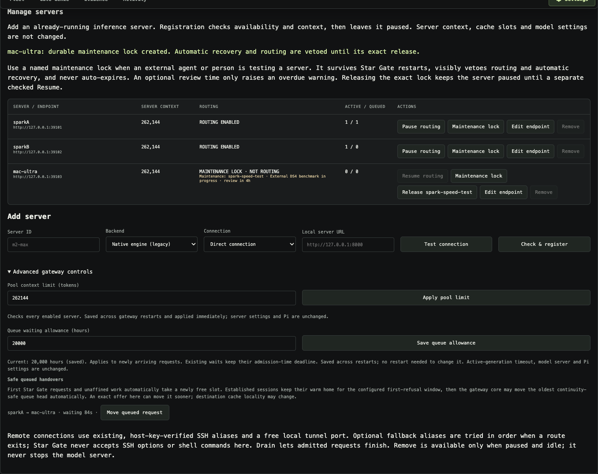

# Star Gate

A local inference gateway and dashboard for OpenAI-compatible model servers,
including DGX Sparks and Macs. Give applications one endpoint while preserving
model-server settings, session affinity and queued conversation order.


[MIT licensed](LICENSE) · [Credits](CREDITS.md)

## Gate Genie uses native Hermes

Gate Genie is a separate native Hermes agent with Hermes' own tools, memory,
skills, cron and Telegram gateway. The previous embedded agent loop, custom
Telegram bridge, automatic assessment calls and tool wrappers have been removed.
The inference gateway works independently of Genie. Dashboard status polling does
not invoke an LLM.

The **Brain** tab edits native provider, model, endpoint and reasoning defaults;
**Soul** edits the profile's SOUL.md; **Memory** reads native memory and skills.
Edits preserve unrelated configuration and back up changed files. They do not
restart a running conversation. Native setup configures credentials and Telegram.
See [installation, configuration and priority](hermes/README.md).

Genie's machine access comes from the account running Hermes and its native
settings. Star Gate does not impose a second tool-approval system. Configure
permissions for your installation through Hermes. Genie requests with the
configured scheduling header take the next compatible available slot ahead of
ordinary queued work; running generations finish normally.

## Dashboard and routing

Server cards group configured hardware and alternative service profiles. Routing
groups and concurrent request capacity are separate counts: a group with capacity
two contributes two possible active gateway requests. Direct backend clients are
outside gateway request counts. Unknown measurements remain unknown.

The UI provides routing controls, Current Jobs, telemetry, media state and local
settings. Inactive media details are collapsed. Monitoring uses local state and
backend measurements, not model-generated reports.

Useful guides:

- [Compatible endpoints](docs/openai-endpoints.md), [backend onboarding](docs/server-setup-guide.md).
- [Serving profiles](docs/serving-profiles.md), [concurrency](docs/concurrency.md), [context limits](docs/context-limits.md).
- [Conversation scheduling](docs/conversation-turns.md), [queue priority](docs/queue-priority.md), [handover](docs/queued-handover.md).
- [Continuity Door](docs/continuity-door.md), [installation](docs/installation.md), [agent CLI/API](docs/agent-api.md).
- [Machine setup](docs/agent-machine-setup.md).

Older worklogs and design proposals describe historical implementations; native
Hermes and the current source are authoritative for the Genie architecture.

## Quick start

**Using DGX Sparks? The current [Qwen Spark settings reference](docs/qwen-spark-profile.md)**
describes Qwen3.8-Flash-Next NVFP4, a custom repaired vLLM 0.29 build, MTP 2,
262,144-token context/output allowances and one active request per server.
The custom engine image is not distributed by this repository; the reference
explains what has been checked and what a fresh machine still needs.
The [earlier DeepSeek profile](docs/recommended-spark-profile.md) remains available
with its original settings and reliability caveats.

Requires Node **22.22.2+**, compatible running model servers, and SSH for remote workers. Gateway runs on macOS or
Linux. The optional click-to-open service scripts use macOS LaunchAgents.
Install and understand your chosen worker engine first. For DS4, use
[Antirez's upstream instructions](https://github.com/antirez/ds4/blob/main/README.md).
This repository does not replace engine installation or distribute model weights.

```sh
git clone https://github.com/JordiPosthumus/dwarf-star-gate.git ~/DSG
cd ~/DSG
npm run setup -- --controls
npm run hooks:install
npm run doctor
npm start
# In another terminal, from the same checkout:
npm run door
# In a third terminal:
npm run ui
```

No `npm install` is needed for the core. Setup creates an ignored, mode-0600
`config.local.json` with a random API key and an empty worker list. Existing
settings are preserved. Omit `--controls` for a read-only dashboard.
Gate Genie is optional and installed separately using [native Hermes setup](hermes/README.md).
Setup does not install or start an agent, contact a model, or configure Telegram.

Open **http://127.0.0.1:30010**, expand **Manage servers**, add existing DS4
endpoints and enable them after the compatibility check. Remote servers need a
working, host-key-verified OpenSSH alias; local servers use their loopback URL.
You may give a remote server up to four fallback aliases (for example stable LAN
DNS, a reserved LAN address alias and a private overlay-network alias). DSG tries
them in order after a tunnel exits. It never accepts SSH options or shell commands,
and private aliases remain in ignored local state. DSG does not install DS4.
New configurations use the stable Continuity Door at
**http://127.0.0.1:30000/v1** and a private replaceable core on loopback port
`30001`; existing configurations are not silently migrated. Read the client key
from your private config, never publish it.

That client key terminates at DSG. Workers are stock, unauthenticated DS4
endpoints kept private by loopback or the SSH tunnel; DSG never forwards its
bearer secret to them. Authenticated generic OpenAI backends are deliberately
outside this DS4-specific worker contract.

**Adding machines with an agent:** use the [machine-onboarding runbook](docs/agent-machine-setup.md).
It includes a copyable handoff, new-Spark preparation, paused live registration,
telemetry, real inference/cache acceptance and rollback without disturbing the
existing fleet.

**Setting up with your own agent:** give any local agent that can run shell
commands the following handoff. Replace the bracketed details with your own
checkout and existing DS4 endpoints; no particular agent framework is required.

> Set up DSG in [checkout directory] using this repository's Quick start and
> `docs/agent-machine-setup.md`. Inspect the existing configuration and running services
> first. For a new installation, use `npm run setup -- --controls`; preserve an
> existing private config. Register only my existing DS4 endpoints [worker IDs,
> loopback URLs or verified SSH aliases]. Ask for missing endpoint details rather
> than inventing them. Keep credentials and machine details in ignored local
> files. Preserve my model, context, output, reasoning and cache settings. Run
> `npm run doctor`, start the gateway/Continuity Door/dashboard using the documented
> method for my OS, and verify a small request through the Door. Report the local
> dashboard and client endpoint, which checks passed, and any remaining setup
> issue without printing credentials. Use the scoped agent guide if I also want
> ongoing fleet management; setup alone does not grant recovery or session control.

The core setup has no npm dependencies. The clean-checkout test exercises private
configuration creation, refusal to overwrite it, doctor, worker registration,
unchanged request forwarding and persistence across a gateway restart using a
synthetic DS4 endpoint. Your real engine and agent still need their own connection
check. Optional [Pi integration](docs/pi-integration-plan.md), hardware collectors
and service recovery have separate setup instructions and capability checks.

On macOS, use login services instead of the foreground processes (stop those
first):

```sh
./start-dsg.sh --open
./gateway-status.sh
./park-dsg.sh
./stop-dsg.sh
```

**Day-to-day operation:** `start-dsg.sh` checks Node, source and
private configuration, makes a private control-state backup, installs missing
login services, starts the gateway core/Continuity Door/dashboard and verifies
their endpoints.
It does not restart an already-running service. `park-dsg.sh` keeps the stable
Continuity Door alive, holds new calls, drains and stops only the gateway core;
the next normal `start-dsg.sh` verifies that core and releases the waiting calls.
`stop-dsg.sh` backs up control
state, refuses busy/unknown gateway state, fences admission and confirms shutdown.
Both preserve worker exclusions. No configuration is generated or overwritten.
Use `--help` for component selection, explicit client interruption and JSON output;
see the [operator-script guide](docs/installation.md#start-and-stop-scripts-macos).

These commands manage only DSG's gateway core, Continuity Door and dashboard,
never model servers.
Worker controls register/enable/drain/remove routing endpoints. Separately enrolled
[service recovery](docs/worker-recovery.md) adds a guarded DS4 restart capability.
The convenience UI launch scripts remain supported on macOS.

**One checkout, no deployment copy:** source, ignored `config.local.json` and
ignored `runtime/` live together. All launchers/operator commands use that config
by default, even from another working directory. `DWARF_GATE_CONFIG` selects a
different file; explicit CLI config arguments take precedence where supported.
Relative local paths resolve beside the config file. Remote SSH paths do not.
See [installation, upgrades and private files](docs/installation.md) for details.

## Monitoring and debugging

The **Thinking** row shows the DS4 serving mode derived from supported request
rules and the server context. Hover to see the original requested fields and
evidence basis. Unavailable interpretations show Unknown; idle cards retain a
marked Last value. The client chooses its reasoning setting. This observation does not
change client requests or server settings.

Per worker, the dashboard displays:

- Actual decode chunk t/s and request-average t/s, including reasoning tokens.
- Actual prefill chunk/average t/s for **new** tokens, excluding the cached prefix.
- Timestamped last readings, independent 15-minute sparklines, gateway health,
  active duration, waiting requests and assigned conversation counts.
- Observed prefix reuse, genuinely cold starts, resident misses and disk restores.
- Recent request outcomes, queue time, elapsed time and returned usage counters.

The dashboard observer also records privacy-safe DS4 process epochs and exposes
conservative [request/engine attribution](docs/request-attribution.md) in local diagnostics and Gate Genie
evidence. Its bounded local audit reports attribution yield and abstention causes
without request identities or text. A separate complete-source reconciliation
view can count later exact usage evidence without rewriting the original
abstentions. Ambiguous, partial or conflicting evidence remains unknown—never a
cache claim.

For a DS4 cache directory mounted on the **same host as the dashboard**, DSG can
optionally inventory stock disk-KV headers without reading their embedded prompt
text. Add an ignored private `cache_directories` mapping, keyed by registered
worker ID. The scanner reads exactly the 52-byte stock header from regular,
non-symlink files named exactly like stock DS4 snapshots (`<40-hex>.kv`),
replaces the prompt-derived 40-hex stem with an installation-keyed HMAC, and
exports only aggregate cohort/count/size evidence. Bare 40-hex names and
unrelated files are ignored.
It never loads, copies, deletes or rewrites a cache. See
[cache acquisition evidence](docs/cache-cost.md#privacy-safe-snapshot-inventory).
DSG does not transfer caches between servers.
Separately, `npm run cache-continuity:audit` evaluates consecutive same-session
reuse from the private numerical dataset. It reports only aggregate counts,
ratios and abstention reasons; low reuse is not called high-suspicion without
unchanged epoch plus consecutive turn/compaction guards, and is never presented
as protocol proof.

Timing comes from a read-only SSH journal follower on Linux. The default remote user unit
is `ds4-vision-q2.service`; set `telemetry_service` per worker if yours differs.
The observer parses known DS4 log formats; missing information is unknown, never
an invented hit or speed. No inference request is made for metrics. Newly registered
workers default to `telemetry_service: null`. An optional `--journal-unit`
on CLI registration enables a Linux worker's journal follower.

For a Mac DS4 engine on the **same host as the dashboard**, add an explicit path
to its existing engine log in the ignored private gateway config, keyed by its
registered worker ID:

```json
"telemetry_files": { "studio": "/var/log/ds4/engine.log" }
```

Use your actual log path; DSG does not create it, change model logging or restart
the engine. Reload **only the dashboard** after editing this mapping. It takes
precedence over journal telemetry for that worker and shows **Model log connected**.
The file must be readable, regular and not a symlink. Missing/unreadable logs show
disconnected, with old samples dated rather than replaced by invented zero rates.
The mapping and raw lines are never exported by status/diagnostics or stored in
measurement logs, and the UI cannot select arbitrary files. This does not yet
follow logs on a remote Mac over SSH; configure a Linux journal or a local file
as appropriate. Do not point it at a log containing interleaved model instances.

Local logs use DS4's `MMDD HH:MM:SS ds4-server:` format and the dashboard host's
timezone (the nearest year is inferred at New Year). Initial replay is limited to
the last 256 KiB and 15 minutes; reads are at most 256 KiB per two-second poll,
partial lines are capped at 64 KiB, and older/oversized/unrecognized lines are
skipped. Rename rotation and copy-truncation are detected; a missing file is retried.
On startup, a separate bounded scan of only the latest 8 MiB may find the most
recent stock DS4 listen marker and derive a one-way, worker-bound process epoch.
This is explicitly weaker than systemd invocation identity; no marker means the
epoch remains unknown. The raw marker, endpoint and file path are never exported.
Unread data removed by rotation can be lost: this is bounded observation, not a
lossless logging service. Stable sample IDs permit replay deduplication. A prompt
start outside the observed tail remains unknown until the next one, even if decode
measurements are already visible. No model request is generated for telemetry.

An idle Spark retains its **last** measured speed with its age. It is not current
throughput. A resident-cache miss can still produce a disk hit. Positive cached
tokens alone do not prove RAM residency. Counts cover observed prompt starts,
including up to 15 minutes / 2,000 initial journal records, not lifetime hit rates.
Non-streaming responses without observed usage show unknown token counters.

Each worker's **Requested thinking** indicator reports the active client's
controls, separately from the engine's current THINKING/DECODE phase. Idle workers
show the last finished request and its age. Hover for the exact source fields:
`reasoning_effort`, `reasoning.effort`, `output_config.effort`, boolean `thinking`
or `thinking.type`, optional `thinking.budget_tokens`, and `enable_thinking`.
These are observations, not a promise that a particular engine honors each field
or distinguishes every requested level. Multiple controls are shown together;
the gateway does not choose their precedence or rewrite them.

Omitted controls show **Not specified**; unknown metadata never becomes an assumed
level. The observer captures up to **8 MiB per dispatched upload in transient RAM**,
parses it once at upload completion, then releases body references and retains only
allowlisted scalar metadata. JSON parsing has a small CPU/temporary-memory cost.
Over-budget, encoded, malformed or incomplete uploads show **Unknown**; their
original bytes continue through the same streaming pipe. This budget is **not** a
request-size, context or output cap. Queued bodies are not inspected before dispatch.
Requested metadata is included in completion events and sanitized diagnostics,
but not persisted in the affinity store. Last-request indicators reset on gateway
restart; old events without metadata remain unavailable.

```sh
./gateway-status.sh
./gateway-logs.sh
./gateway-debug.sh
```

The **Debug snapshot** button or command exports allowlisted metadata only:
status, bounded recent timings and the last 100 request events. It excludes
prompts, answers, images, tool arguments, credentials, backend addresses and raw
journal lines. Hashed conversation identifiers, request IDs and timings remain;
review even sanitized diagnostics before sharing publicly.

Parsed measurements are appended to private daily JSONL files under `dashboard/`
beside the configured state file (the default is `runtime/dashboard/`).
`sample_id` deduplicates history replay across dashboard restarts. Logs are **not**
deleted or automatically rotated: choose retention for your installation.
Raw gateway logs can contain SSH error messages and host details; do not publish
them without review. Monitoring logs are separate from the inference path.

The local **Evidence** panel shows request collection and cache-cost evidence.
Measured fleet speed, energy and continuity outcomes remain available. See the
[operational evidence guide](docs/analytics.md). XGB forecasting, training and
embedding collection have been retired.

## Client affinity

Send a stable `x-session-affinity` header for each conversation. Other accepted
headers are `x-ds4-conversation-id`, `x-session-id`, and `session_id`.
Use distinct, unpredictable identifiers for independent conversations.
Without a header, requests work but do not receive durable session affinity.

The gateway returns `x-ds4-node`, `x-ds4-affinity`, and `x-request-id`. Bodies and
SSE bytes remain unchanged. Reassignment only occurs when the old home is
unavailable/drained **and** has no unresolved work for that conversation. Already
queued requests retain their original home through recovery waiting unless they
meet the [queued-handover contract](docs/queued-handover.md). The new assignment is
durably saved before queue ownership changes. Never change a worker ID to mean a different machine
without considering its persisted assignments and caches.

Worker membership can change live without restarting the gateway. Stable IDs retain
their assignments. Removing a paused, idle worker leaves its old session homes in
the store; the next request can reassign normally. It does not delete server caches.

The UI snapshots and validates its full HTML/CSS/JS/image bundle at startup.
Stage all UI files and test first, then reload only the dashboard to promote a
complete release. Editing files does not partially update a running dashboard.

## Operator controls

Set `"ui_worker_management": true` in your private config and reload the dashboard
to expose **Manage servers**. Keep this dashboard on loopback, not behind a public
proxy. The controls use the private Unix socket, exact same-origin checks and a
per-dashboard CSRF token. They do not change inference API authentication.

1. Enter a stable server ID and choose **Local server** or **Remote server via SSH**.
2. For a local server, enter its URL. For SSH, supply an existing SSH host/alias,
   the remote server port and an unused local tunnel URL.
3. **Check & register** verifies the configured model and sufficient context. A
   successful registration is persisted **paused**, with no generation probe.
4. **Enable** admits requests. **Drain** stops new admission while already admitted
   work finishes. **Remove** is available only when paused and idle.

**Client routing is not worker membership.** To make a client use a Mac or Spark
only through DSG, change that client's provider endpoint to DSG and remove its
direct-provider entry. Keep the model server registered and enabled in DSG.
Draining/removing that worker instead takes its capacity away from **all** gateway
clients. Ask agents to distinguish these two operations explicitly.

Unexpected **Paused** or missing workers warrant checking `workers_drain_changed`
and `worker_removed` in the private gateway log. Failed health probes do not
remove workers; generation quarantine is a separate state. Legacy operator events
record the action and target, not an authenticated individual. The new scoped
[agent API](docs/agent-api.md) records the credential's principal and owned hold;
that identifies a grant, not which model or human possessed it. Native Hermes can use local operator commands when its account and settings permit them. Restarting DSG preserves manual pauses and removals.

**Agent handoffs:** use `agents.sh` to grant access to named workers, inspect live
status, acquire a drain hold and release only that agent's hold when its test is
finished. Other agents' holds and operator pauses remain in force. The UI names
holding agents and offers **Keep paused** for an operator reservation. Setup,
copyable agent instructions, JSON API and retry/cleanup rules are in the
[agent access guide](docs/agent-api.md). No Pi/Hermes dependency or LAN admin
listener. “Resume” enables routing; it does not start a stopped model server.
Separately opt-in [service recovery](docs/worker-recovery.md) can start an exact
loaded-but-stopped systemd service only after static identity enrollment and all
recovery guards; ordinary worker controls and endpoint registration cannot.

<details>
<summary>Worker-management UI (synthetic demo)</summary>



</details>

Registration leaves native context, output limits, hot/disk slots, quantization,
thinking and server concurrency unchanged. Every worker must support at least the
configured pool `context_length`. A larger-context Mac keeps that native capacity;
the gateway advertises only the common pool guarantee in `/v1/models`. It does not
truncate prompts or outputs or automatically send oversized requests to that Mac.
For its larger context, use that server directly or a separately configured pool.
No per-request token counting or capability-tier routing is implemented.

DSG automatically refreshes each worker's reported context during health probes,
but **does not automatically raise or lower the pool guarantee**. Change it under
**Settings → Manage servers → Advanced gateway controls → Pool context limit**: DSG checks every enabled server,
backs up its metadata, saves the explicit setting and applies it immediately.
No model or gateway restart is required to apply a limit with this control.
The saved setting survives restart and overrides the startup `context_length`
default. Pi/client settings are separate. See
[Context limits and rolling upgrades](docs/context-limits.md).

Remote connections use gateway-owned SSH tunnels; existing SSH authentication and
host trust must already work. Registration does not install DS4 or provision keys.
Use each physical server once: different SSH aliases can hide a duplicate endpoint,
which model-name/context checks cannot detect.

The same controls are available from the CLI:

```sh
./workers.sh list
./workers.sh add studio --url http://127.0.0.1:8000
./workers.sh add laptop --url http://127.0.0.1:38103 --ssh worker-c --remote-port 8000
./workers.sh resume studio
./workers.sh drain studio
./workers.sh lock studio --name benchmark --reason "External DS4 test" --review-after-hours 4
# Later: release the exact returned lock ID; the server intentionally stays paused.
./workers.sh unlock LOCK_ID --reason "Test completed and endpoint checked"
./workers.sh resume studio
./workers.sh remove studio
```

`--config FILE` or `DWARF_GATE_CONFIG` selects your private config. The original
drain/resume CLI also remains supported:

```sh
node ds4-gateway/control.mjs status
node ds4-gateway/control.mjs drain-worker spark1
node ds4-gateway/control.mjs resume-worker spark1
```

Drain stops new admission to the named worker; existing queued/active requests
finish. State persists across gateway restarts. Six workers can drain four and
continue with two. The controller cannot stop model servers or creative jobs.
Each manual pause/resume now retains a bounded timestamped control-channel receipt
(`dashboard`, `workers_cli`, or another local path) and exposes the latest receipt
in that server's routing tooltip. This identifies how the request reached the
private operator socket, not which human or same-user process initiated it. A
scoped agent cannot clear an operator pause; native Hermes may use the unrestricted
local operator CLI when authorized. Use scoped holds for maintenance agents. For an
external test or stronger cross-agent veto, a [named durable maintenance lock](docs/maintenance-locks.md)
survives restart, blocks broad Resume and every recovery path, and never
auto-expires. Its optional review time only warns. Releasing the exact lock leaves
the worker paused until a separate checked Resume.
SIGUSR1/SIGUSR2 globally pause/resume admission; SIGTERM requests graceful gateway
shutdown. Service-manager deadlines can still interrupt long streams. Do not kill
or restart a live gateway casually; there is no blind restart script.

**Persistence and rollback:** `config.nodes` seeds the initial fleet. After the
first add/remove, `workers` in the existing affinity state file becomes the
authoritative roster, including an empty roster; editing seed nodes no longer
changes it. Back up both config and state before upgrades. Before rolling back to
an older gateway without registry support, copy the current roster into that older
version's compatible config during a planned shutdown. Otherwise removed seed
workers could return. Never restore an old affinity snapshot over newer sessions
without explicitly accepting that loss of routing history.

## Tests

```sh
npm run check
npm test
npm run privacy-check
npm run privacy:test
```

The Node unit/integration suite exercises local HTTP fixtures—not GPUs. Coverage includes
byte preservation, affinity persistence, FIFO admission, cancellation, no retries,
two-to-six-worker expansion, draining four of six, private operator control,
slow consumers, cache classification, journal deduplication, diagnostic redaction,
six-worker monitoring, complete UI asset bundles, hot registration/removal,
larger-context workers, empty-roster persistence, bounded health probes and the
opt-in same-origin/CSRF management boundary, local-log timing/cache parsing,
partial/oversized lines, rotation, truncation, missing-file recovery and redaction.
It also covers protocol-specific SSE completion and privacy-safe early-ending
classification, bounded JPEG/GIF repair/guidance,
persistent generation quarantine,
verified reinstatement after remove/re-add, fresh control sockets after restart,
collector privacy, privacy-safe Agent Watch correlation, and bounded Genie/recovery boundaries. `npm run recovery:test`
also tests both optional Python service adapters. See the
[dated maintenance review](docs/maintenance-review-2026-09-02.md) for findings and scope.
Default dashboards remain read-only.
Pool-size tests cover 1, 2, 3, 6, 12 and 20 fixture workers. These are validation
points, not configured limits or a claim of unlimited-scale load testing.
GitHub Actions runs checks and tests on Linux and macOS.

Validate streaming, reasoning, vision, tools, representative long-context work and
real disk restoration on each deployment. Local fixture tests do not certify a
100-hour stream soak, every client integration or every hardware/reboot combination.

## Security and privacy

The example binds loopback and contains only placeholders. **No private harness
configuration, production configuration, private network addresses, conversation
logs, model files, KV data or credentials are distributed.** Local configuration
and runtime output are ignored. A privacy check catches accidentally staged files
and common private data patterns; it is a guardrail, not a completeness guarantee.
Use `npm run hooks:install` to enable the repository-local pre-commit check.
The [publication policy](docs/publication-policy.md) separates reusable public
guidance from private deployment histories; exact staged blobs are checked and
the installer preserves existing custom hooks. New clones must opt in.

Treat this as a trusted-operator tool, not a multi-tenant security boundary. Keep
the inference listener behind an access boundary if exposing it beyond loopback.
The UI is loopback-only, validates Host/Origin, has no CORS grants, and uses a
restrictive content policy. The observer account needs DS4 journal read access.
Adding the UI does not change any model launch setting.

## License

Star Gate is open source under the [MIT License](LICENSE).
Copyright © 2026 Jordi Posthumus.

You may use, modify, redistribute, sublicense and sell DSG, including in commercial
or closed-source projects. Keep the copyright and license notice with copies or
substantial portions of the software. No visible UI credit or endorsement is
required; crediting the project publicly is appreciated. The software is provided
without warranty, as described in the license.

DS4, dependencies and separately obtained model weights retain their own licenses
and notices; DSG's license does not replace those terms. See [credits](CREDITS.md).


The dashboard’s **Brain** tab edits Gate Genie’s native Hermes provider, model,
API endpoint and reasoning setting. Saves preserve the rest of `config.yaml`
and back up the previous file under the Hermes profile’s `brain-history/`.
Hermes reads these defaults between turns; an explicit conversation `/model`
override still takes precedence. Saving does not restart Hermes or reset its
conversation. **Test connection** only lists provider models and submits no
inference. Credentials remain managed by native Hermes setup. Dashboard status
polling reads local runtime state and does not ask Genie to generate reports.

### Pool model discovery

For OpenAI-compatible or model-agnostic workers, the gateway resolves its logical
pool name (usually `PoolModel`) from the existing `/v1/models` health check. A
single-model endpoint automatically follows model replacements, including a
stale saved pool alias. A valid configured pool alias takes precedence on a
multi-model endpoint; otherwise a native model matching the pool name is used.
An ambiguous catalogue requires an explicit pool alias; list order is never a
model-selection policy. Other explicit model names and aliases remain unchanged.

Model discovery, request translation and the displayed serving model use the
same resolution. Updates take effect after the next successful existing health
probe (normally within five seconds); model changes should finish before new
work is admitted. This adds no polls, LLM calls or inference retries, and does
not alter context limits, generation settings or request concurrency.

On a single-model Qwen 3.8 backend, maximum reasoning is spelled `xhigh`.
The gateway translates a top-level Chat Completions `reasoning_effort: "max"`
to that native spelling. This preserves maximum reasoning; it does not change
Genie's saved setting or requests sent to GLM. Other effort values, nested tool
arguments, prompts and generation parameters pass through unchanged.
