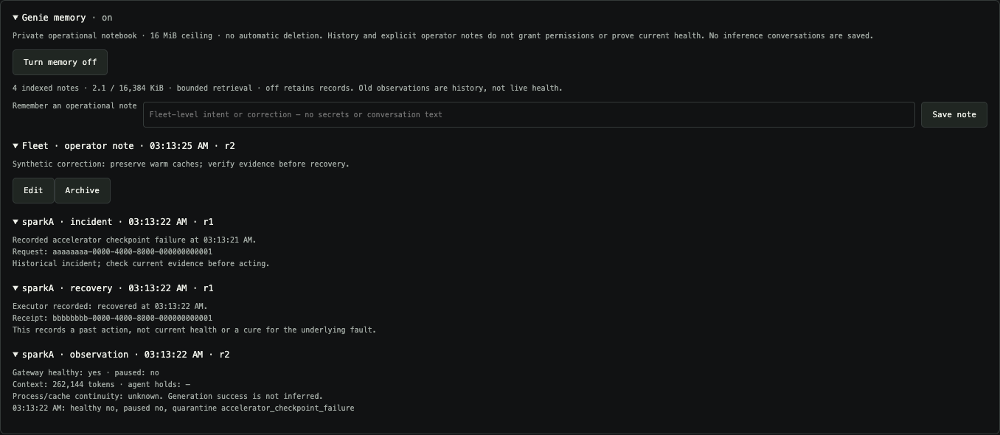

# Gate Genie memory — first release and remaining plan

Status: **bounded operational memory and developer hardening suggestions implemented,
opt-in and off by default**. A small, private, DSG-owned operational
notebook, not a replacement for the collector, predictor or permission checks.
It survives dashboard restarts and changing Genie's model or device. It needs
neither Pi/Hermes nor a permanently warm DS4 session.

## Available now

Open **Genie memory** on the dashboard and select **Enable memory**. This enables
only the notebook, not Genie inference, recovery or prediction-assisted routing.
The initial storage ceiling is **16 MiB**, with **no automatic deletion**; enabling
it accepts that ceiling. At the ceiling, writes pause visibly. Existing data,
inference, the collector and ordinary stateless reviews remain available. Memory
off retains the journal and removes notebook history from subsequent reviews.

The first release records:

- Fresh, changed worker observations: gateway health, pause/hold state, known
  context and allowlisted quarantine reason. Missing samples do not become outages.
- Incident request IDs and bounded recovery-operation receipt references. A past
  `recovered` receipt is not proof of present health or a cure for the engine bug.
  Incident and recovery rows are not automatically declared causally related.
- Explicit operator notes, with create/edit/archive controls, revision checks and
  save receipts. Archive excludes a note from retrieval without erasing history.
- Gate Genie developer suggestions for exact, code-selected failure envelopes.
  Candidate fields are only failure class, fleet/worker scope, allowlisted reason,
  evidence time, continuity outcome and allowed evidence references. Prompts,
  answers, images, session keys, arbitrary logs and long-generation guesses are
  excluded. The model supplies only a bounded title and suggested experiment.
  Code reattaches the authoritative candidate facts, deduplicates by class/scope/
  reason and writes a revision only when the evidence time or suggestion changes.
  Repeated signatures keep their newest occurrence within the bounded review
  input, not the oldest duplicate. This is not an all-history incident count;
  distinct workers, failure classes and reasons remain separate envelopes.

The private journal is `runtime/genie/memory/notebook.jsonl` beside the configured
gateway state. Files are mode 0600 inside a mode-0700 directory. It survives model,
source and dashboard changes; an existing enabled setting also survives restart.
Genie's inference enable setting remains separate. A configured Genie starts on
after restart unless private config explicitly sets `genie.enabled` to `false`;
the notebook still has its own durable opt-in setting.
The dashboard is its sole writer. Corrupt/partial journals, permission problems,
conflicting writers and failed fsyncs stop memory writes; there is no automatic
repair or deletion. Inspect/back up the journal before manual repair. A storage
fault can prevent persisting a subsequent disable; verify the setting after repair.

Retrieval is at most **12 records / 16 KiB**, with operator notes first, developer
suggestions next and other records newest first, limited to current worker IDs plus fleet notes. Each worker
observation can include its seven prior transitions; older revisions remain on
disk. This is bounded retrieval, **not a complete notebook browser**. Removed
workers' history stays on disk. Reusing an ID does not prove the same process:
process/cache epochs and generation verification remain explicitly unknown.
Records older than seven days are labelled review-due, never silently deleted.
Reports show the IDs/revisions supplied to the model. They are context, not action
offers; executor permissions and current evidence still govern every action.

Notebook contents never enter diagnostic exports or XGB training. Do not save
secrets, inference content or raw logs in operator notes. A configured Genie may
receive the bounded notebook history, including notes, at its selected endpoint;
choose that endpoint accordingly. HTML in notes is displayed as text.

Tests cover real dashboard HTTP controls/CSRF, durable reload, corruption, write
failure, stale samples, bounds, privacy and lack of additional action authority.
`npm run memory:test` runs these tests. The optional browser fixture,
`npm run ui:memory-screenshot`, checks actual controls, polling, restart persistence,
escaping and mobile layout against synthetic workers and disposable storage only.

**Not yet implemented:** free-form model-authored hypotheses outside the bounded
candidate contract, text search, scoped permanent deletion, performance/experiment
rollups, full chat/report persistence, or measured operational benefit. The design
below remains the roadmap for these extensions; it is not a claim that all of them
are running.

## Remaining design and guiding rules

## Purpose and ownership

Genie should recognize recurring incidents, show what helped last time, avoid
fruitless repeated experiments and follow up on unresolved issues. Example:
“This worker repeated the accelerator failure. The previous enrolled restart
restored service; generation has not yet been verified this time.” Each factual
part needs an evidence reference. An old remedy is not automatically safe now.

| Owner | Authoritative material | Genie's use |
| --- | --- | --- |
| Collector and numerical summaries | Timestamped observations, outcomes, provenance and coverage | Measured facts, not remembered speeds |
| Predictor lifecycle | Frozen data/artifacts, CV, independent gates, baseline/champion state and receipts | Forecasts and actual experiment results |
| Genie notebook | Evidence-linked incidents, hypotheses, lessons, open questions and operator notes | Context, investigation priorities and explanations |

Link existing durable records rather than copying all telemetry, vectors or
model reports. Deterministic code produces numerical rollups; Genie cannot write
training labels. Executors independently recheck current action offers. A memory
never creates authority. Genie/memory failures must not block routing, collection,
forecasting or the fixed fallback.

## What to remember and think about

1. **Incidents/recovery:** worker and known process/config epoch, allowlisted
   error signature, first/last occurrence, observed symptoms, action receipt,
   subsequent observations and outstanding follow-up. Distinguish endpoint health
   from successful generation, and mitigation from fixing the underlying bug.
2. **Performance:** references to prefill/decode and service-time distributions
   by worker *and* hardware class, context range, observed cache regime and
   requested thinking when known. Show sample counts, time window, dispersion and
   missingness. “This Mac is slow” without workload context is not a useful fact.
3. **Availability:** observed reachable/eligible/paused/quarantined time,
   failures, recoveries and monitoring gaps. OS uptime, DS4 process uptime and
   DSG observation age are distinct; unknown stays unknown. A log reconnect is
   not a restart. Operator pauses are not outages. Never claim availability for
   periods when monitoring was absent.
4. **Cache health:** suspected misses with prefix/usage/log evidence and
   attribution confidence. Compaction, conditioning changes, worker/profile
   changes and cold starts can explain misses. Similar text proves neither
   reusable KV nor a cache bug. Heuristics are not ground-truth labels.
5. **Experiments:** recipe/window, immutable snapshot/model IDs, CV and independent
   validation results, training cost and receipt; why a candidate lost/regressed.
   Reconsider after hardware/traffic changes. Keep synthetic/production evidence
   distinct. Repeated searches on one holdout are not independent confirmation.
6. **Operator intent:** explicitly saved notes about intentional pauses,
   investigation priorities and preserving warm caches. Live config wins;
   neither recalled preferences nor chat can grant a restart, resume, migration,
   DS4 setting change or weaker promotion gate.
7. **Open questions/upstream opportunities:** evidence needed, cheapest safe
   next check, last review date, and links to the
   [contribution policy](ds4-integration.md#upstream-contributions).

Do not store inference prompts, tool results, reasoning traces, keys, raw logs
or full operator-chat transcripts. The operator can explicitly save a concise
operational note. Predictor embeddings stay in their separate private dataset;
they are sensitive and not needed to search a few hundred operational notes.

## Small storage contract

Private `runtime/genie/memory/`, directory 0700/files 0600, excluded from Git,
screenshots and diagnostic exports by default. One append-only event journal is
durable; a rebuildable index supports retrieval. No new database/vector service.
The dashboard is the single writer: serialize writes, write/fsync before success,
reject symlinks, preserve incomplete/corrupt tails for investigation. Disk failure
stops memory writes visibly and leaves stateless reviews/inference available.

Each versioned record carries:

- ID/revision/type, bounded title/body, created/updated/last-verified timestamps.
- Fleet/worker scope, hardware class and known process/config/cache-profile
  identity. Endpoint/model name alone is not process or cache identity.
- Provenance (operator, deterministic extractor, Genie hypothesis), exact source
  IDs/time range, and action/experiment receipt IDs where applicable.
- State (open/resolved/superseded/archived), verification
  (observed/hypothesis/stale/disputed), review-after and superseded-by references.

Genie proposes structured incident summaries/hypotheses with existing evidence
IDs. The writer validates ID existence, scope, epoch, lengths and current source
availability. That does not certify a causal conclusion: generated prose stays
labelled a hypothesis. Extractors own numerical facts; only operators pin their
preferences. Updates are revisions; repeated incidents are deduplicated by
signature/scope without losing occurrence counts. No receipt means no verified
action, however confidently a report claims success.

## Retrieval and review

Every review combines current fleet evidence and allowed actions with relevant
open incidents, recent changes, a few comparable past episodes/experiments and
pinned intent. Use exact worker/epoch/type matching, recency and simple text
search first. Initial notebook budget: 12 notes and 16 KiB, smaller if the model
requires it. Never drop current control rules to fit history; disclose truncation.
Memory is labelled untrusted data, never system instructions or tool definitions.

Fresh verified state outranks old notes. Changed epochs invalidate claims about
*current* cache residence/health, while old incidents remain comparable history.
Unknown epoch means no continuity claim. Expose conflicts and require new evidence
before repeating stale diagnoses. Ask: What changed? Has this happened before?
Did the last action actually help? Which workload regime is prediction failing
on? What is missing? What is the cheapest safe check? Cite evidence when accusing.

## Retention and UI

Bounded retrieval is not silent deletion. Start with no automatic deletion of
existing source data. Proposed review defaults: incident notes review-due after
7 days without new evidence; speed summaries refreshed from their stated window;
cache-residence assertions expire with source validity/epoch, not an invented
TTL. Resolved incidents remain history. Pins cannot make measurements current.
The first release requires opt-in to its 16 MiB ceiling and no-deletion policy.
Future configurable ceilings/retention need an explicit operator decision. At the
ceiling pause writes visibly, never silently evict. “Forget” must specify notebook
content versus separately retained source evidence; erasing one is not both.

Add a compact **Memory** section: enable switch, state/count, last successful
write, open/review-due incidents and storage health. Memory retrieval/writes are
independent of Genie inference and predictor controls. Off retains records and
changes no permissions. Show notes used by each report and actual save receipts.
Allow view/search, explicit “Remember this operational note,” correction, archive
and scoped forget. Show age, evidence, worker/epoch and hypothesis/stale labels.
Health-wire live claims still require fresh evidence. Existing sticky learning
milestones remain separate. Public examples use synthetic identities/data only.

## Delivery and tests

1. Read-only numerical summaries with supported joins and explicit missingness;
   no claimed process uptime without a supported measurement source.
2. Durable notebook: schema, serialized writer, idempotent revisions, bounded
   retrieval/recovery. Import existing receipts only where linkage is exact;
   do not invent old Genie reports.
3. **Implemented for bounded failure candidates:** opt-in review/UI integration,
   deduplicated hypothesis revisions and save receipts. The compact top-of-page
   panel is newest-first; with memory off, a completed report's suggestion is
   explicitly page-local. No extra recovery, migration, server-mutation or
   deployment authority.
4. Evaluate recurrence recall, fewer repeated unsupported suggestions, correct
   worker/epoch attribution and bounded review overhead in actual use. Do not
   label anecdotes as measured routing gains.

Test restart/model-source continuity, concurrent/idempotent writes, disk-full and
corruption, retrieval limits, missing/expired sources, worker remove/re-add,
process changes/unknown epochs, monitoring gaps, pause versus failure, null versus
zero, hostile stored instructions, no authority escalation, privacy-safe exports,
UI polling preserving open notes, and unaffected gateway/baseline with memory off
or broken. Memory is a failure-tolerant aid, not a dependency of safe operation.

## Next learning slices

Extending memory need not delay early client metadata, reviewed bounded XGB
recipes and cache-preserving calibration preflight. Memory explains experiments;
it never supplies labels or grades a model. Calibration may stay skipped until a
non-displacing path is proved; organic traffic needs no synthetic generation.
