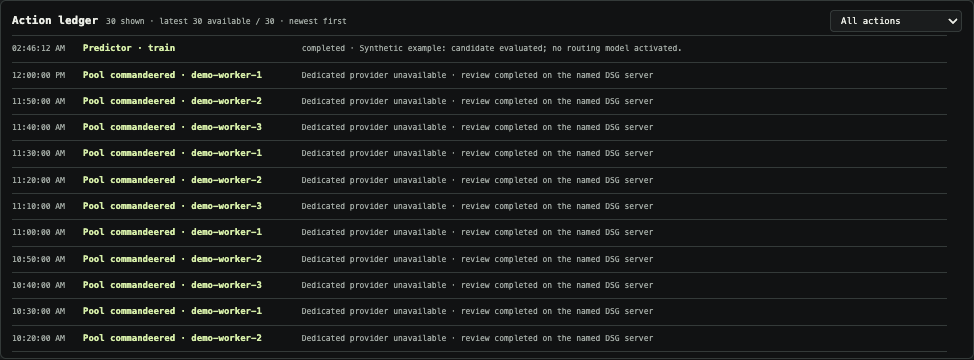

# Evidence collector and Gate Genie (experimental first slice)

## Collector

See the [exact field-by-field schema](collector-schema.md) for what is and is not
recorded, including the distinction between routing evidence and engine logs.

Optional [early client hints](client-metadata.md) are recorded at admission with
client-reported provenance. They do not change inference.
The opt-in [Genie notebook](genie-memory.md) persists operational observations,
incident/recovery references and explicitly saved notes, separately from numerical
collection. Full health reports and chat transcripts are not persisted.

Set `"dataset_enabled": true` in your private gateway config, then restart the
gateway when safe. Model servers and their settings do not need to change.
The default is off. Evidence is written under `requests/` beside the affinity
state file, in daily mode-0600 JSONL files inside a mode-0700 directory.

Records have a schema version, gateway-run ID, event ID and request ID. Join
`decision`, `dispatch` and `finish` by run/request ID. Other terminal records
identify queued cancellation, expiry or unavailability before dispatch.
An incomplete sequence after a crash is incomplete evidence, not a success.
Events are asynchronously batched and flushed; an abrupt crash can lose pending
events or leave a partial trailing line. Readers must reject incomplete lines.

- Decision features are captured before assignment and queue insertion.
- `profile` fingerprints endpoint/model/advertised context, **not** an attestation
  of engine binary, quantization or cache configuration; those fields need future
  explicit instrumentation. Do not treat unchanged profile as proof of cache survival.
- Queue/service/total durations use a monotonic clock. `first_body_byte_ms` is
  explicitly first upstream body bytes, **not** guaranteed first semantic token.
- Chat Completions/Completions SSE usage and bounded Responses terminal usage are
  copied only when supplied. Non-SSE and Messages start/delta usage remain unknown.
  SSE finish reasons are retained when supplied: an HTTP-complete response with
  `finish_reason: length` is output-limited, not an uncensored completion target.
  Missing finish reasons remain unknown, not assumed `stop`.
  Requested thinking is observed after upload; it is not currently a decision-time
  feature. Input byte counts are not token counts.
- The observer traffic marker is client-declared, not an authenticated identity;
  it grants no authority. Exclude Genie reviews from normal-workload benchmarks.
- Separate engine timing logs remain useful, but this slice does not guess a
  request-to-engine join from nearby timestamps. No cache bug attribution yet.

The queue is bounded to 512 events, 64 KiB per event, 128 candidate snapshots per
decision (truncation explicitly flagged). These bound telemetry only, never fleet
size, context or inference. At 1 GiB stored, collection pauses and reports an error;
it **does not delete evidence** or block inference. No automatic expiry yet.
The UI shows current-run saved/pending/dropped counts, total stored bytes and last
write. Retention remains an operator decision. No raw text, credentials,
embeddings or model features are stored. Keep the journal out of Git and public exports.

Completion observation understands each supported API's terminal event rather
than requiring `[DONE]` for every stream. Oversized, unobservable endings are
`sse_observation_limited`, excluded from successful completion evidence, and counted separately
from engine failures. This observation limit does not truncate forwarded output.

## Genie

The compact **Gate Genie ticker** in the fleet overview contains **Genie-written**
observations and, when warranted, a short recommendation. The same model call
produces the detailed assessment and one to four ticker entries; no second
summarizer or extra periodic inference call is added. The prompt asks for serious,
concise advice, not jokes. Enable Genie to receive these headlines; with Genie off,
the ticker says so rather than substituting template diagnoses.

Each review returns JSON with `assessment` and `ticker`. Entries contain
`severity` (`good`, `info`, `warning` or `critical`), `text`, nullable `recommendation`, and
`evidence_refs` from the supplied fleet/dataset/worker vocabulary. Length, count
and reference checks reject malformed output; they **do not prove the model's
claims correct**. A rejected ticker leaves its answer readable in the report list
and shows an explicit wire status, never an invented replacement diagnosis.
Text is rendered inertly, not as HTML or executable commands.

Each headline has its own subdued shade and visible severity label: **Good** in
green, **Info** in cool gray, **Warning** in amber, and **Critical** in soft red.
One warning does not recolor unrelated headlines. Existing warning/info reports
remain compatible; unknown or unavailable assessments appear neutral, not as an
all-clear. The Genie chooses severity from supplied evidence, not keyword matching
in the browser. These colors are advice, not independent health proofs or recovery
permissions. Missing data, long thinking or a busy queue alone is not critical.
The wire shows the **evidence snapshot's time**, not the answer completion time.
After ten minutes, a changed inference source, or a change to fleet membership,
health, pause, quarantine, context or gateway-draining state, previous advice is
withheld. Missing gateway status also withholds recommendations. Ordinary queue
movement does not invalidate every review; counts describe that timestamp, not a
live ETA. A failed refresh is labelled while any still-valid review remains.

The briefing explains that historical queue durations are milliseconds, missing
thinking metadata does not alter forwarded reasoning settings, and a resident
cache miss may still restore from disk. The model is instructed not to infer a
stall from long thinking or to claim an action occurred. The wire itself is
advice only. Separately structured requests may ask deterministic executors for
one exact offered recovery or queued-handover action; prose never
grants a power.

Per-worker `immediately_free` is computed from health, pause/quarantine, gateway
draining, active and queued state. An empty waiting queue does not make a busy
server idle. The briefing distinguishes automatic first/unaffined queued handover
from an exact evidence-bound established-session offer, and states that cache
locality after the latter is unknown. An operator or Genie may request one mature
offer; DSG revalidates it before moving the undispatched stream. It also warns that cache counters may include
diagnostics or unequal observation windows. These explicit facts reduce
misinterpretation; they are not an LLM accuracy guarantee or permission to execute
its recommendations.

Headlines scroll at approximately 42 CSS pixels/second, separated by 8rem gaps.
Hover or keyboard focus temporarily freezes motion and headline updates so the
current item can be read. The timestamp stays with the frozen evidence.
Reduced-motion preferences show wrapped static text, and the repeated scrolling
copy is hidden from screen readers.

In the web UI, open the **Gate Genie** tab. **Enable** /
**Turn off** controls the observer. The source dropdown chooses a dedicated-first
policy or explicit DSG-pool use; it does not edit endpoint addresses. In dedicated-
first mode, a new review can select fresh, free compatible DSG capacity when a
recent dedicated attempt failed or took at least 60 seconds. Up to 16 attempt
records are kept in memory; dedicated evidence expires after 30 minutes, so it
survives the normal five-minute review cadence. A positively witnessed TCP refusal
before connecting can still use the configured fallback. Timeouts, resets, HTTP
errors and malformed answers are not non-dispatch proof and do not trigger replay. With no `genie.url`, DSG
uses its own pool by default and Gate Genie starts enabled; no extra bot framework
or endpoint is required. An explicitly configured dedicated endpoint automatically
gets a bounded pool fallback unless `genie.fallback` overrides it. There is no URL/model/
credential editor in the UI yet. Set these in
your private config's `genie` / `genie.fallback` objects, then restart only the
dashboard and enable the observer again. Do not change worker URLs or the pool
model just to change the Genie's inference source.

For implemented recovery permissions, see [bounded worker recovery](worker-recovery.md).
Each provider attempt is bounded: both the dedicated provider and pool default to
two hours so long local reasoning is not mistaken for failure. Set an endpoint's
`timeout_ms` from 1,000 through 86,400,000 milliseconds only when its hardware
needs a different budget. The UI separately shows elapsed time and actual remaining
allowance; it does not format a future deadline as an elapsed timestamp. A timeout
counts as a failed attempt with unknown backend completion; it does not permit
a duplicate review. A subsequent new review uses fresh evidence and may select
available pool capacity before dispatch.
Genie inference uses a loopback-only streaming HTTP transport whose sole deadline
is that configured allowance. It does not inherit Node's shorter built-in Fetch
response-header deadline, so a legitimate long DS4 queue or prefill cannot defeat
the two-hour policy at five minutes. Connection, HTTP and response-validation
failures remain explicit and still permit only the one configured fallback.
A dashboard question preempts an ordinary periodic assessment so chat does not sit
behind replaceable health commentary; it never shortens the provider allowance and
still waits for an evidence-gated action review, which is not safe to interrupt
halfway through its decision.

The separate **Automatic recovery** switch authorizes the runner, not the Genie's
Enable button alone. Editable endpoint controls remain in the [powers plan](genie-powers-plan.md).

Example **private** config addition (illustrative ports/SSH alias):

```json
{
  "genie": {
    "url": "http://127.0.0.1:38011/v1",
    "model": "deepseek-v4-flash",
    "ssh": "conductor-host",
    "remote_port": 8001,
    "fallback": {
      "url": "http://127.0.0.1:30000/v1",
      "model": "deepseek-v4-flash",
      "api_key": "YOUR_GATEWAY_KEY"
    }
  }
}
```

Omit `ssh`/`remote_port` for an already-local endpoint. The dedicated server's API
key is optional; omit it for unauthenticated DS4 behind authenticated SSH. SSH uses
your existing verified host key and login, loopback-only forwarding, and reconnects
without changing the remote server. Keep the chosen local port free.

Restart the dashboard. A configured Genie is **on by default** and his first
review starts within ten seconds. **Turn off** pauses him for the rest of that
dashboard run; private config may set `"enabled": false` for an installation that
should start off. Recovery mutation remain separately gated;
enabling observation does not grant those powers. Subsequent automatic reviews
start no more often than every five minutes **after the prior review finishes**;
a slow review therefore cannot create a permanent back-to-back review loop. Manual
questions have a 2,000-character limit and one review can run at a time. A manual
question submitted during a scheduled review is held as the single pending
question, then run next. Its in-memory receipt remains visibly `queued`,
`answering`, `answered`, `failed` or `cancelled`; question text is never included
in status, diagnostics or the request journal. Turning Genie off cancels a
queued question. A dashboard restart cannot preserve unsent question text.

Status includes the sanitized attempts for the current or latest review: dedicated,
pool, pre-dispatch pool assignment or proven-refusal pool fallback; start/finish times; `complete`, `failed` or `cancelled`;
and a fixed reason category. It never includes endpoint details, credentials,
prompts, raw responses or raw transport errors. This makes a slow provider,
explicit fallback and failed review distinguishable without granting new powers.

The same tab has a compact, reverse-chronological **Action ledger** with filters
for pool commandeering, recovery, queue moves and items needing
attention. Pool rows distinguish a new review assigned before dispatch from a
completed dedicated-provider fallback. Historical fallback rows retain their old
meaning; they are not retroactively treated as proof of non-dispatch. The server is
named only when the gateway returned a validated `x-ds4-node` receipt. Recovery rows come from their durable executor journals, queue moves from
the bounded recent evidence reader, and completed provider fallbacks from a private
local receipt journal. Operator actions are excluded. No prompt, answer, request/session
identifier, endpoint, credential or raw error enters the ledger, and no row is a
claim that model prose directly performed an action.

The scrollable, keyboard-focusable ledger renders the latest 30 available actions
across these feeds, newest first, with filters over that window. Its count is
explicitly available history, not a lifetime total. Recovery status
exposes up to 30 recent receipts per feed; other actors can occupy those source
windows before the ledger filters them out. The dashboard separately keeps 30
small completed pool receipts so rotating full review text does not
erase recent provider history. These receipts now survive dashboard restarts in
`genie/actions/pool-actions.jsonl` beside runtime state: report UUID, completion
time, fallback kind and an observed worker ID (or unknown). Full reviews, questions,
endpoints and action offers are never restored from this journal. This is an
operational receipt log, separate from the optional memory notebook and its toggle.
New `pool_assigned` receipts use a separate `pool-assignments.jsonl` file. The
original fallback file is not rewritten or given new record kinds, preserving
its readability by the older release. Both files retain their independent
bounded storage and protective writer checks; the UI combines the latest 30 rows.

The directory/file are mode 0700/0600. Appends are exclusive-writer guarded and
file/directory-synced; readers reject corrupt tails, duplicate IDs and unsafe
links/modes without repairing or deleting evidence. At the 16 MiB ceiling, or if
storage fails, new receipts remain in the current session's 30-row view and the
ledger shows **pool history not saved**. `/api/genie` exposes
`provider_action_storage` with bounded status and a sanitized error. Storage errors
do not retry inference/actions or invalidate a completed review. The ceiling does
not prune old evidence or cap inference. Receipts missing before this feature was
installed are not invented. This remains a mixed-source recent view, not a durable
consolidated archive of every Genie action or every failed provider attempt.

Developer suggestions are hypotheses, not executor receipts. Review instructions
ask for a specific test and the outcomes it would distinguish, avoid conflating
transport refusal/reset with identity failure, and forbid blanket replay advice
for interrupted streams. Passive evidence comes before permitted synthetic tests;
pauses, reservations and warm-cache preservation still apply. Instructions also
discourage repeating existing advice without a materially new test or observation.
These are model-output quality rules, not deterministic proof of note quality;
older notes are retained rather than silently rewritten.



Illustration only, not live fleet evidence. To reproduce and test the ledger in
Chromium and WebKit with optional Playwright installed, run
`DSG_LEDGER_SCREENSHOT=docs/images/genie-action-ledger.png node scripts/check-genie-ledger.mjs`.

The experimental observer uses low-effort, maximum-8,192-output-token review
requests with a configurable bounded provider deadline. The current default is
two hours because local long-context DS4 reasoning may be slow; the live deadline
and elapsed time are visible while a review runs. These are its
own requests, **not production server defaults or limits on user requests**. A
budget-exhausted answer is reported incomplete, never presented as a finished
assessment. Existing server context, output settings and caches are unchanged.

The source selector chooses dedicated-preferred or DSG-pool-only operation.
Pool requests remain unpinned and receive no private Genie notebook history.
Fast assignment uses the exact configured DSG pool URL, matching model, fresh
status no older than six seconds, and a healthy free worker without holds,
quarantine or recovery. It never treats an arbitrary custom fallback as this
known pool. Explicit pool selection retains ordinary queuing when necessary.

A compatible core advertises `genie_flexible_assignment`. New ordinary Genie pool
reviews then keep their original socket and unread body in the existing bounded
waiting lane until a compatible worker is free. A worker pause and earlier
assigned work remain authoritative; a cancellation removes the pending review.
This handles a free-slot race without failing the question or reissuing its body.
Older cores keep the prior queue behavior. The separate short Priority Lens
classifier still uses atomic no-wait admission and abstains if capacity is busy.

A `pool_assigned` report identifies a new review selected before dispatch.
`pool_fallback` is used only after the transport witnesses a fresh TCP socket
refusing connection before it ever connected. Partial answers and actions from a
failed attempt are never combined with another attempt. Off cancels the local
connection; that alone does not prove backend execution stopped.

These are local source and fixture guarantees, not a claim that an existing live
dashboard has been upgraded. Provider deadlines, output/reasoning settings,
server configurations, cache ownership and normal request deadlines are unchanged.

This is a question + fresh-briefing interface, optionally augmented by bounded
notebook history, not a persistent multi-turn agent conversation. Twelve recent assessments live in memory and are
not included in downloadable diagnostics or request records. The model has no
shell or control credentials. Its optional structured `recovery_requests`,
and `relocation_requests` are validated against exact current
offers and rechecked by their deterministic runners;
prose is rendered as text, never executed. Durable executor receipts are separate
from in-memory assessments and are included in sanitized operational status.
The dashboard's same-origin/CSRF checks protect its enable/source/ask and notebook
controls. Memory can collect while Genie inference is off; switching memory off
retains its records. Notes are excluded from diagnostic exports and request journals.

See the sanitized [worker-reachability incident](incidents/2026-09-03-worker-reachability.md)
for the distinction between tunnel self-healing, busy-server probe evidence and
an evidence-authorized DS4 service recovery.

Click a report heading (or focus it and press Enter/Space) to read the assessment.
The five-second status refresh preserves open reports and text selection. The
panel normally shows the latest three reports; an older open or keyboard-focused
report stays visible while you read, even as newer reports arrive. This is only
page-local reading state, not durable history across a page/dashboard restart.

Model training and embedding collection have been retired. Turning Genie off
does not disable operational collection or the separately authorized recovery
runner. See the [roadmap](roadmap.md) for remaining work.


Dashboard transport explanations distinguish a running SSH tunnel process from
a verified DS4 readiness response. A refused endpoint connection, a reset and a
probe timeout are separate observations, without an inferred root cause or any
claim about a different inference request. Pause routing preserves the running
DS4 listener, admitted work and caches.

Image-recovery cancellation remains a cancelled request: cancelled normalized
retries do not increment visual failures, and a converter error arriving after
client cancellation cannot create a guidance receipt. Existing historical
counters remain unchanged. These source changes require a separate rollout.
